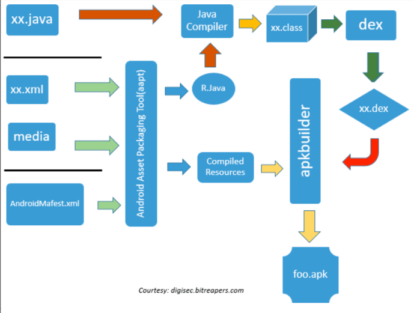
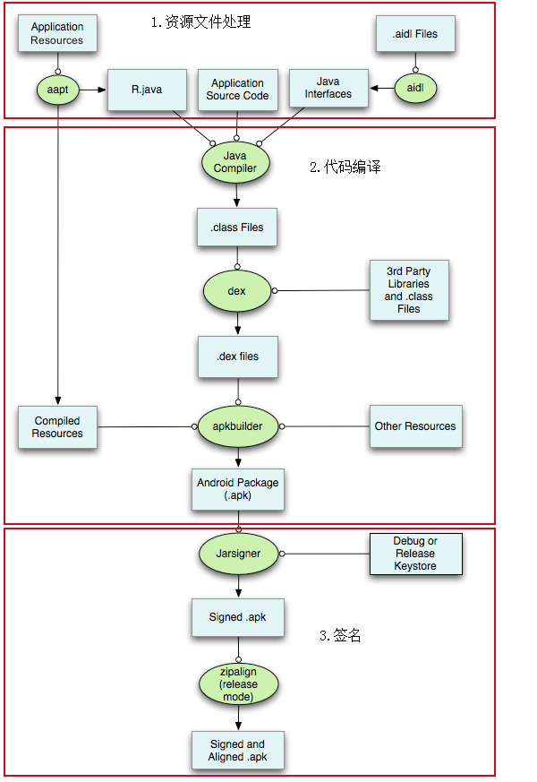

# apk编译打包流程

## APK打包流程

`apk`打包流程图=`apk`产生过程：

和

具体的解释是：

* 资源处理
  * 这一过程中主要
    * 使用appt工具进行资源文件的处理
      * 分析AndroidManifest.xml中的资源文件
      * 生成R.java和resources.arsc文件
    * aidl工具负责处理aidl文件
      * 生成对应的java接口文件
* 代码编译
  * 将上一过程中产生的R.java、java接口文件以及工程源代码一起通过Java Compiler编译成.class文件，打成Jar包
    * 这部分可以加入代码混淆）
      * 比如用`ProGuard`
  * 然后与第三方库的Jar包一起通过dx工具转换成.dex文件
    * 注：如果apk的方法数超过了65535，会生成多个dex文件
      * 反编译的话需要对这多个dex文件均进行转换Jar包处理
  * 通过apkbuilder工具将aapt生成的resources.arsc、classes.dex（可能多个）、其他的资源一块打包生成未经签名的apk文件。
* 添加签名
  * 通过Jarsigner对生成的未签名的apk进行签名。
  * 再通过zipalign对签名后的apk进行对其处理，使apk中所有资源文件距离文件起始偏移为4字节的整数倍，从而在通过内存映射访问apk文件时会更快。
