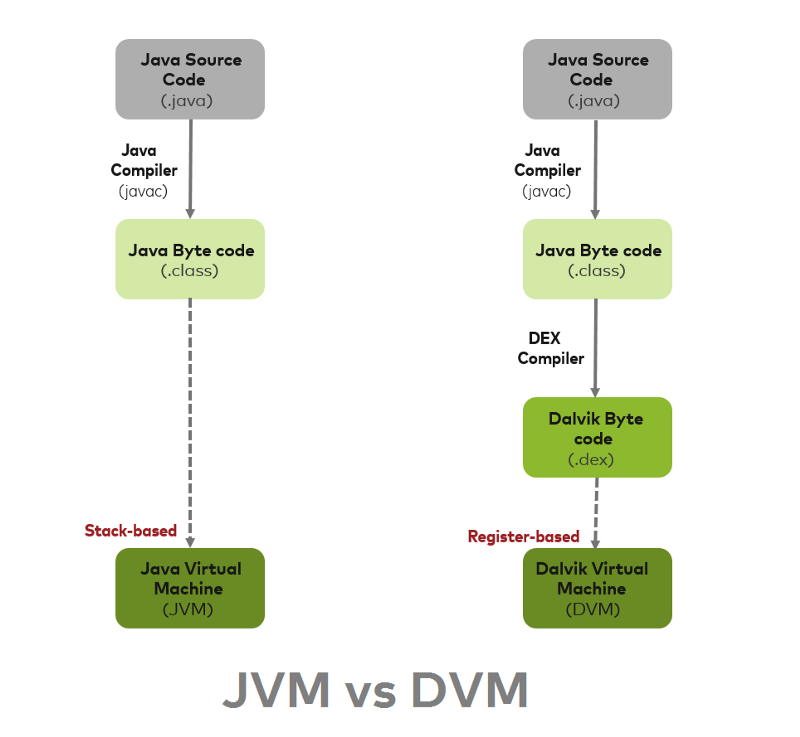
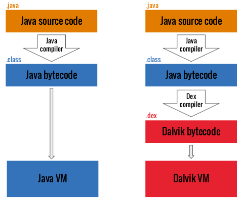

# Dalvik

* `Dalvik` = `Dalvik VM` = `DVM`
  * 概述
    * `Dalvik`是`google`专门为`Android`操作系统设计的一个虚拟机，经过**深度的优化**。虽然Android上的程序是使用java来开发的，但是Dalvik和标准的java虚拟机JVM还是两回事
  * `JVM` vs `DVM`
    * 对比： JVM vs DVM
      * 执行的字节码文件不一样
        * `JVM`执行的是`.class`文件=`Java Bytecode`
        * `DVM`执行的是`.dex`文件=`Dalvik Bytecode`
      * 文件类型变化
        * `JVM`: `.java` –> `.class` –> `.jar`
        * `DVM`: `.java` –> `.class` –> `.dex` –> `.apk`
      * 运行环境不同
        * `DVM`：允许运行多个虚拟机实例
          * 每一个应用启动都运行一个单独的虚拟机，并且运行在一个独立的进程中
        * `JVM`：只能运行一个实例
          * 也就是所有应用都运行在同一个`JVM`中
    * 编译流程对比
      * 
      * 
    * JVM：
      * `基础`：基于栈帧`Stack-based`
      * ·文件格式·：`java字节码`=`java bytecode`
      * 效率：相对低
    * DVM：
      * `基础`：基于寄存器`Register-based`
      * `文件格式`：dex
      * 效率：`DVM`效率比`JVM`高
        * 速度更快，占用空间更少
