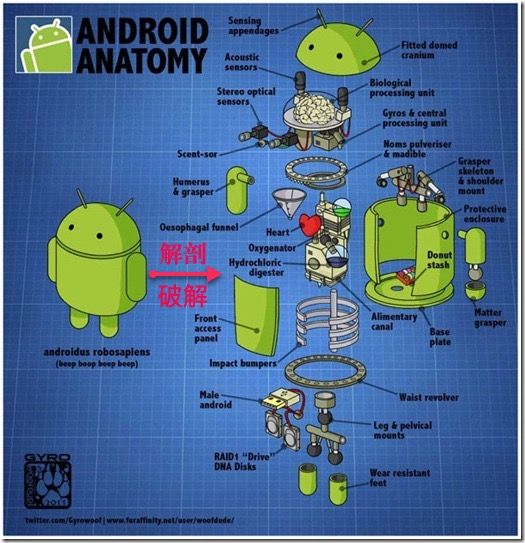

# 安卓破解技术

安卓破解相关的叫法有很多，整理如下：

* 安卓应用的`存在形式`
  * 静态的
    * 安装文件：`apk`
  * 动态的
    * 运行中的程序叫：`app`
* `安卓破解`=`android crack`
  * 破解
    * =`crack`=`cracking`
    * 也叫`安卓逆向工程`=`安卓反向工程`
      * 而逆向工程，就像对一个人去解剖
        * 
  * 针对于
    * 不同的加密和安全技术
      * 之前：`加固`=`安卓加固`=`安卓应用加固`=`Android app hardening`
        * =`加壳`
          * 注：壳是一段保护软件不被非法修改或反编译的程序
        * 破解加壳所以叫：`去壳`=`脱壳`=`反加固`
    * 之前正常编译(`compile`=`compiling`)出apk的过程
      * 破解也常被叫：`反编译`=`decompile`=`decompiling`
        * 所以相关工具往往也叫做：`反编译器`=`decompiler`
