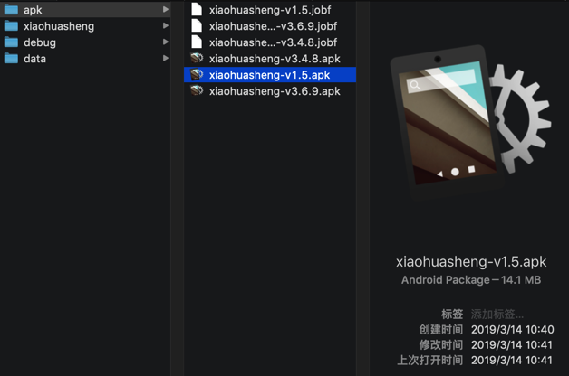
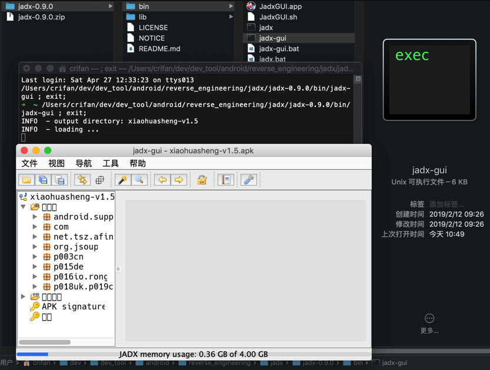
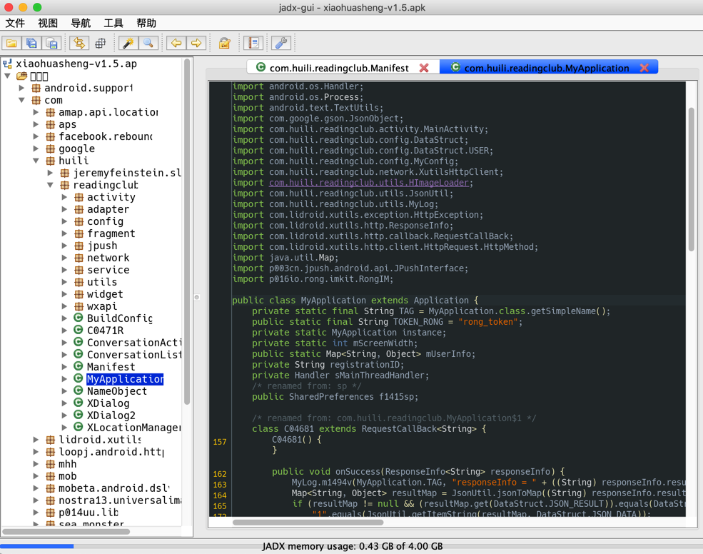
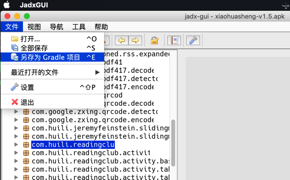
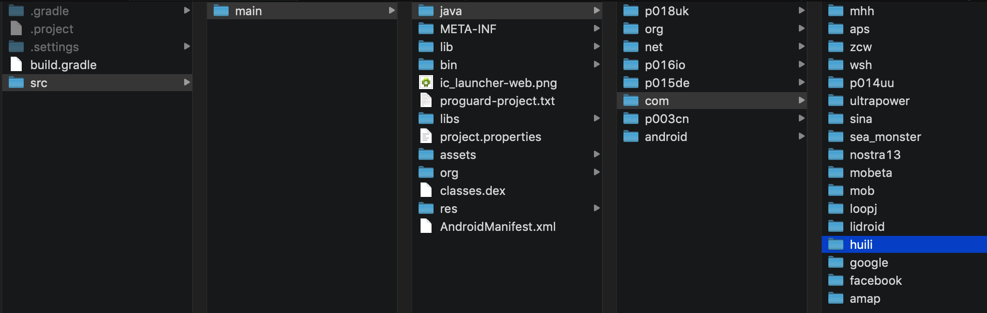
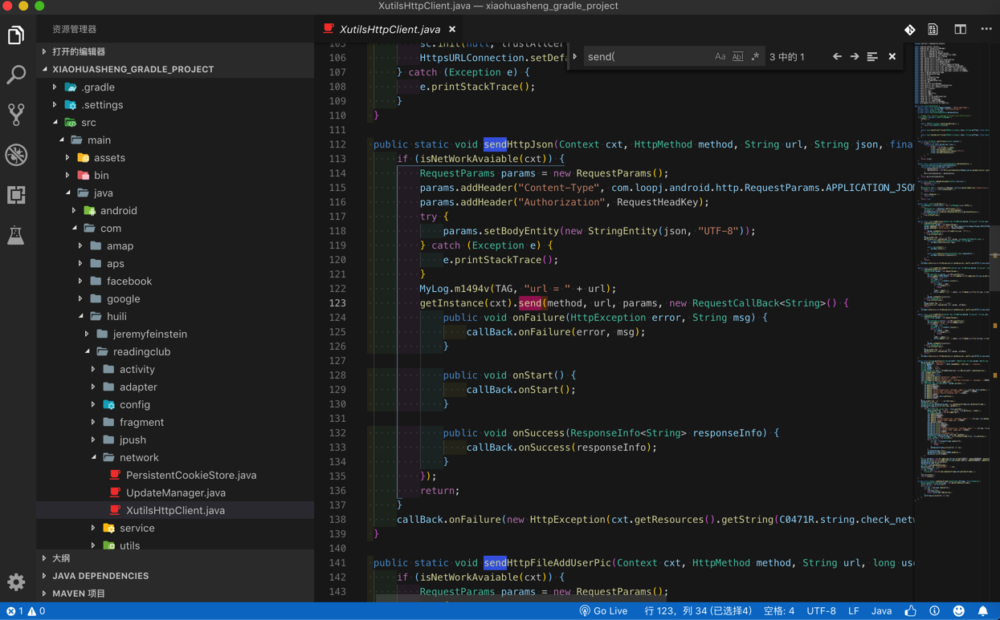

# 一步: apk->java

## 前提

* apk没有被加固
  * 怎么看出是没有加固？
    * 如果你用jadx打开看到的和导出的代码和目录结构都是 qihoo奇虎360 tencent腾讯乐固legu 字样的
      * 那么说明就是被加固了的
        * 用的是 360加固保 腾讯乐固legu 的加固方案
        * 这样导出的代码也只是加固后的代码
          * 不是app的自己的业务逻辑的java代码

## 思路

用`jadx`等工具，直接从`apk`转换出`java`源代码

## 准备

下载`jadx`：

从[skylot/jadx: Dex to Java decompiler](https://github.com/skylot/jadx)的[releases页面](https://github.com/skylot/jadx/releases)下载最新版本，比如[jadx-0.9.0.zip](https://github.com/skylot/jadx/releases/download/v0.9.0/jadx-0.9.0.zip)

解压得到：

* `bin/jadx`：命令行版本
  * `bin/jadx.bat`：Windows版
* `bin/jadx-gui`：带图形界面的版本
  * `bin/jadx-gui.bat`：Windows版

详见：[反编译器jadx](../../android_crack_tool/decompiler/common_decompilers/jadx.md)

## jadx命令行版

直接通过命令行去反编译，效率最高。

语法：

```bash
jadx -d output_folder your_apk_file.apk
```

举例：

```bash
jadx/jadx-0.9.0/bin/jadx -d from_jadx_command xiaohuasheng-v1.5.apk
jadx/jadx-0.9.0/bin/jadx -d exported_java_src mafengwo_ziyouxing.apk
```

## jadx gui图形界面版

下面以`jadx-gui`(已被我改名为`JadxGUI`)为例去解释。

对于此处v1.5这种没有加固的apk：



`jadx`（此处指的是`jadx-gui`）打开后：



可以看到源码：



想要导出全部源码，则可以去

`文件 -> 全部保存`

或

`文件 -> 另存为Gradle项目`



即可导出全部的代码：



用VSCode打开后即可找到（希望研究的app对应的业务逻辑的）代码：


