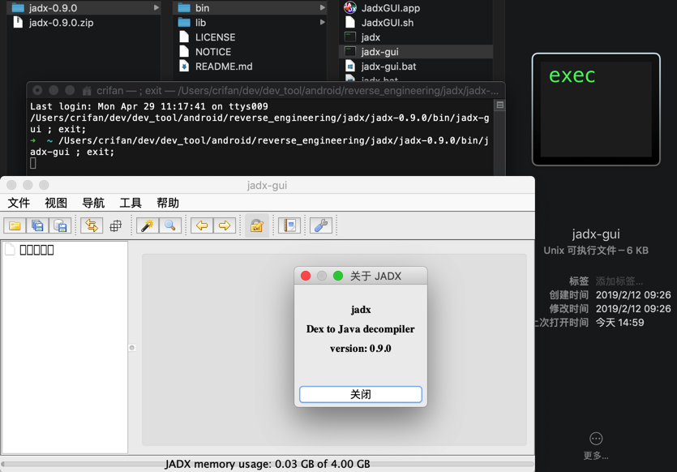
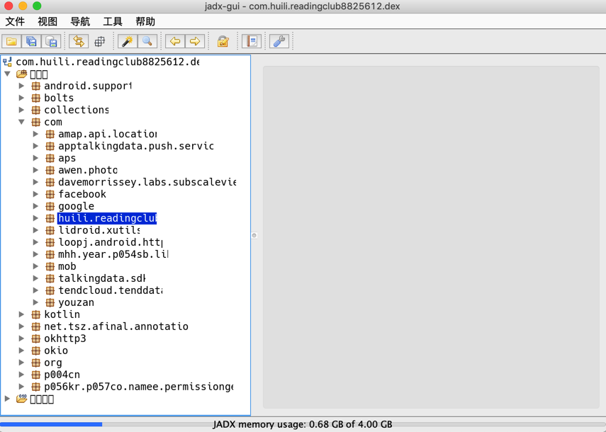
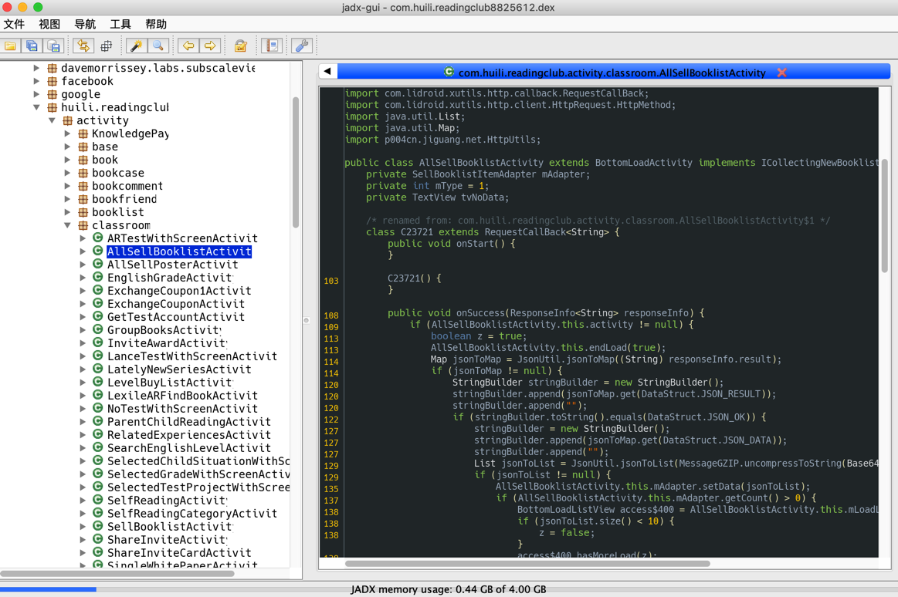
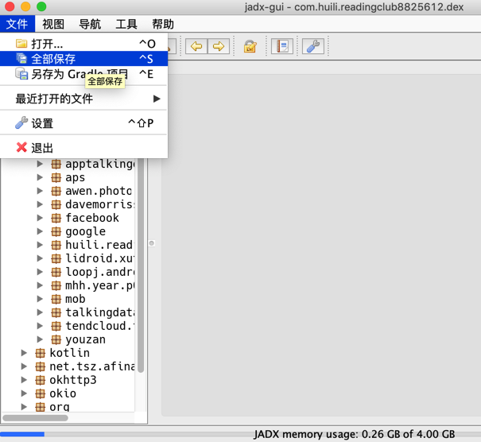
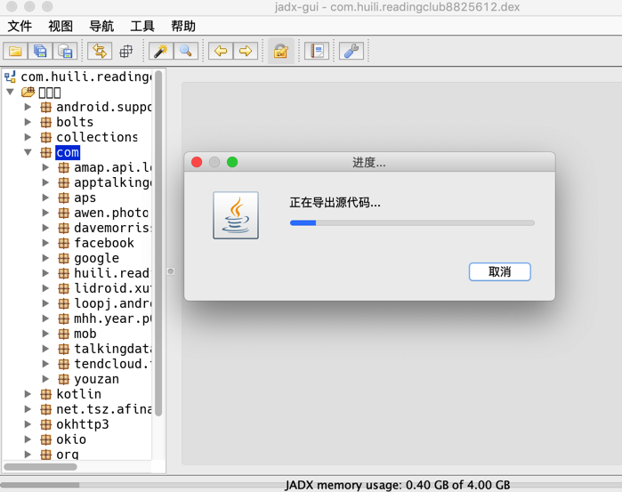
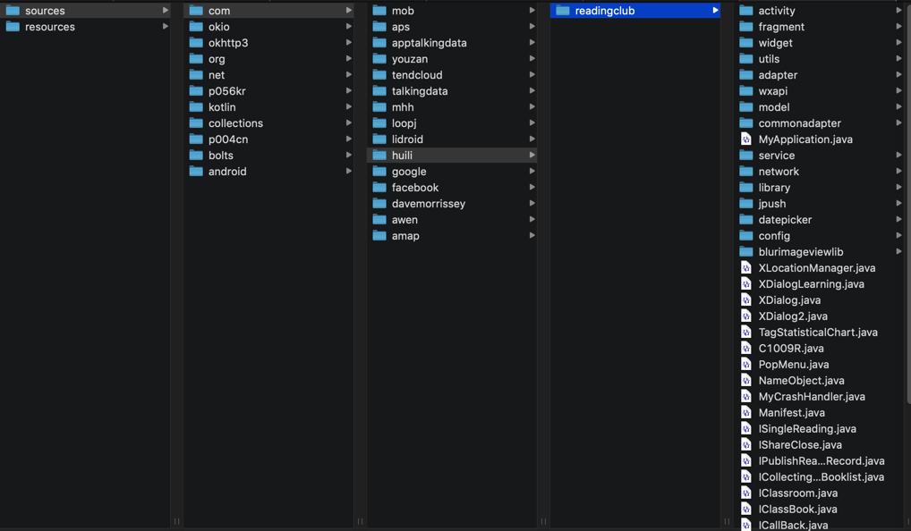
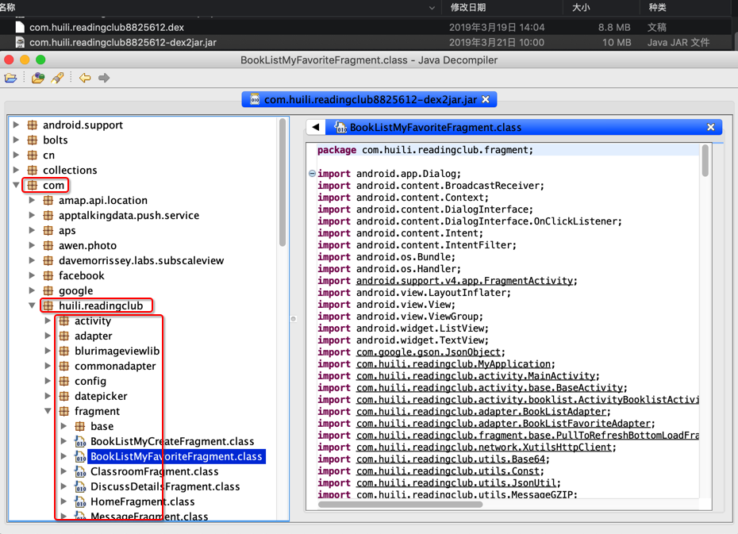
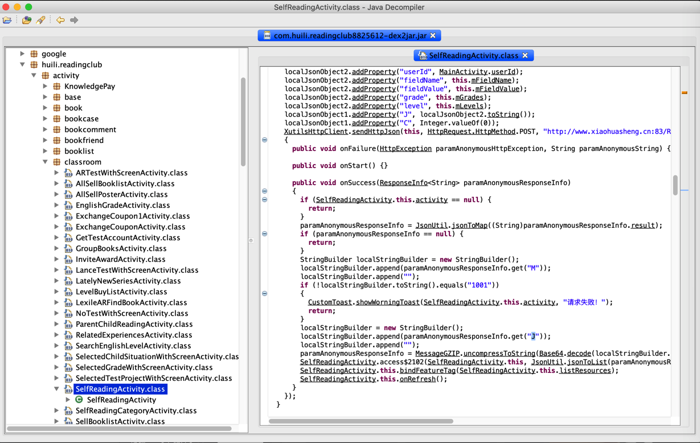
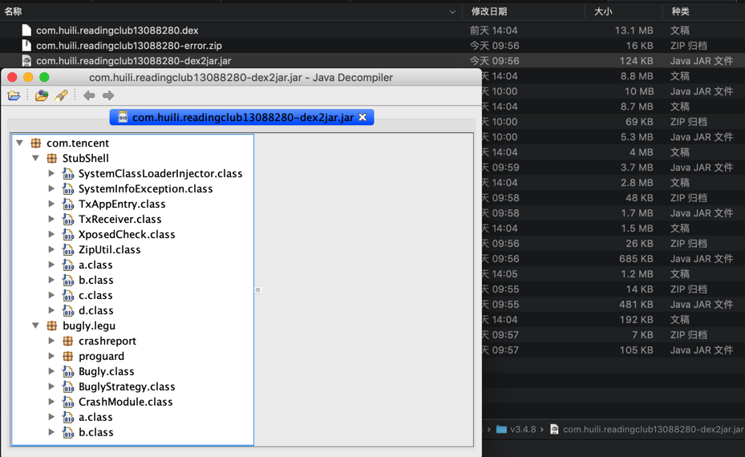

# 2.1 dex转java

`jadx`可以直接从`dex`导出`java`源码

## 下载`jadx`

* 从[这里](https://github.com/skylot/jadx/releases)下载最新版的`jadx`
  * 比如：
    * [jadx-0.9.0.zip](https://github.com/skylot/jadx/releases/download/v0.9.0/jadx-0.9.0.zip)
  * 解压后得到：
    * `jadx`：命令行工具
    * `jadx-gui`：带图形界面的
      * 双击即可运行

此处想要用`jadx`去从`jar`中导出代码，有两种方式：

* 用`jadx`的命令行直接导出代码
* 用`jadx-gui`查看代码，也可以再导出代码

下面详细介绍

### `jadx`直接导出代码

切换到要导出代码的目录，已有dex文件要导出，则可以直接运行：

语法：

```bash
bin/jadx dex_file.dex -d output_folder
```

举例：

```bash
jadx-0.9.0/bin/jadx dex_file.dex -d .

../../../../../../reverse_engineering/jadx/jadx-1.0.0/bin/jadx ../../apk_to_dex/com.ishowedu.child.peiyin/com.ishowedu.child.peiyin8392664.dex -d com.ishowedu.child.peiyin8392664_java

../../../../../reverse_engineering/jadx/jadx-1.0.0/bin/jadx ../dex_to_jar/com.ishowedu.child.peiyin9201516-dex2jar.jar -d .
```

即可转换出源代码到当前目录下，输出有：

* resources
* sources
  * 有你要的源码

转换速度还是不错的。

#### 举例

```bash
from_v3.4.8_dex /Users/crifan/dev/dev_tool/android/reverse_engineering/jadx/jadx-0.9.0/bin/jadx ../../../../../xiaohuasheng/app_hook_dump_dex/FDex2/v3.4.8/com.huili.readingclub8825612.dex -d .
...
中间很多错误
...
WARN  - Found 75 references to unknown classes
ERROR - 6 errors occurred in following nodes:
ERROR -   Method: android.support.v4.provider.FontsContractCompat.getFontFromProvider(android.content.Context, android.support.v4.provider.FontRequest, java.lang.String, android.os.CancellationSignal):android.support.v4.provider.FontsContractCompat$FontInfo[]
ERROR -   Method: cn.addapp.pickers.util.LogUtils.getTraceElement():java.lang.String
ERROR -   Method: cn.jiguang.a.a.b.c.a(android.os.Message):void
ERROR -   Method: cn.jiguang.d.b.f.a(int):boolean
ERROR -   Method: cn.jiguang.d.d.m.a(android.content.Context, boolean):java.util.List<java.io.File>
ERROR -   Method: cn.jiguang.g.e.a(java.lang.String, java.util.Map):cn.jiguang.g.e
WARN  - 2299 warnings in 454 nodes
ERROR - finished with errors
```

转换后：

```bash
➜  from_v3.4.8_dex ll
total 0
drwxr-xr-x   3 crifan  staff    96B  4 29 15:29 resources
drwxr-xr-x  13 crifan  staff   416B  4 29 15:30 sources
```

转换后的代码用VSCode去打开的效果：


### `jadx-gui`查看和导出代码

双击`jadx-gui`即可运行：



然后去打开对应的jar文件：`com.huili.readingclub8825612-dex2jar.jar`，即可看到包含了app业务逻辑的代码结构和包名：



然后展开后可以看到详细的代码：



然后如果想要导出全部代码，则可以去：

`File -> Save All`



然后稍等片刻：



即可在导出的`sources`文件夹中找到你要的源码：



具体过程详见：

[反编译器 Jadx](http://book.crifan.com/books/android_app_security_crack/website/android_crack_tool/decompiler/common_decompilers/jadx.html)

## 备注和说明

### 用`JD-GUI`打开同一个`jar`的效果

另外，用`JD-GUI`打开同一个jar的效果：



其中找到了我们之前需要的app相关的业务逻辑的代码：

`/com/huili/readingclub/activity/classroom/SelfReadingActivity.class`



其中`onSuccess`中就是我们希望得到的对于`J`字段解密的逻辑。

### 其他无效的jar转换出jar的效果

如前一步所说的，从多个`dex`可以转换出多个`jar`

而这些无效的，没有包含app业务逻辑的`jar`，去用一些反编译工具打开，效果是：


其他的一些，比如腾讯乐固加密了的，最终转换出来的jar，去打开后只能看到腾讯乐固的代码：



## 注意事项

### `jadx`不能从`jar`导出`java`，否则会报错

举例：

```bash
../../../../../reverse_engineering/jadx/jadx-1.0.0/bin/jadx ../dex_to_jar/com.ishowedu.child.peiyin9201516-dex2jar.jar -d .
INFO  - loading ...
INFO  - converting to dex: com.ishowedu.child.peiyin9201516-dex2jar.jar ...
ERROR - jadx error: Error load file: ../dex_to_jar/com.ishowedu.child.peiyin9201516-dex2jar.jar
jadx.core.utils.exceptions.JadxRuntimeException: Error load file: ../dex_to_jar/com.ishowedu.child.peiyin9201516-dex2jar.jar
    at jadx.api.JadxDecompiler.loadFiles(JadxDecompiler.java:138)
    at jadx.api.JadxDecompiler.load(JadxDecompiler.java:102)
    at jadx.cli.JadxCLI.processAndSave(JadxCLI.java:32)
    at jadx.cli.JadxCLI.main(JadxCLI.java:18)
Caused by: jadx.core.utils.exceptions.DecodeException: java class to dex conversion error:
 dx exception: Translation has been interrupted
    at jadx.core.utils.files.InputFile.loadFromJar(InputFile.java:191)
    at jadx.core.utils.files.InputFile.searchDexFiles(InputFile.java:82)
    at jadx.core.utils.files.InputFile.addFilesFrom(InputFile.java:40)
    at jadx.api.JadxDecompiler.loadFiles(JadxDecompiler.java:136)
    ... 3 common frames omitted
Caused by: jadx.core.utils.exceptions.JadxException: dx exception: Translation has been interrupted
    at jadx.core.utils.files.JavaToDex.convert(JavaToDex.java:63)
    at jadx.core.utils.files.InputFile.loadFromJar(InputFile.java:182)
    ... 6 common frames omitted
Caused by: java.lang.RuntimeException: Translation has been interrupted
    at com.android.dx.command.dexer.Main.processAllFiles(Main.java:614)
    at com.android.dx.command.dexer.Main.runMultiDex(Main.java:365)
    at com.android.dx.command.dexer.Main.runDx(Main.java:286)
    at jadx.core.utils.files.JavaToDex.convert(JavaToDex.java:49)
    ... 7 common frames omitted
Caused by: java.lang.InterruptedException: Too many errors
    at com.android.dx.command.dexer.Main.processAllFiles(Main.java:606)
    ... 10 common frames omitted
```
