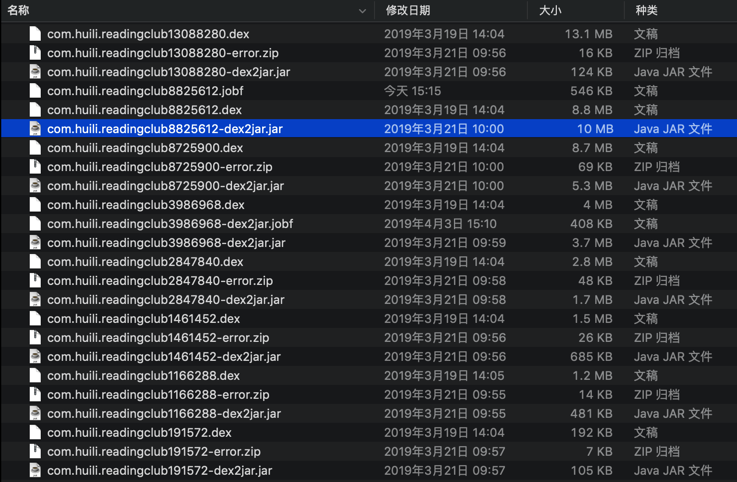

# 2.2.2 jar转换出java

## 准备

* 前面一步从`dex`转换得到的`jar`文件
  * 
* 选择合适的反编译器：`procyon`
  * 用于从`jar`转换出`java`源代码
  * 网上很多人提到了用的比较广的：`JD-GUI`
    * 经过实测，基本够用，但不够完美
  * 后续自己测试了多个其他的反编译器
  * 最终结论如下：
    * `Jadx` > `Procyon` > `CFR` > `JD-GUI`
      * 详见：[常见反编译器对比 · 安卓应用的安全和破解](http://book.crifan.com/books/android_app_security_crack/website/android_crack_tool/decompiler/common_decompiler_compare.html)
      * 注：此处`jadx`其实是，直接从`dex`转`java`，而其他几个反编译器是从`jar`转`java`，略有不同。请使用时稍微注意区别。
  * 所以此处选用：`procyon`
    * 关于反编译效果更好的`jadx`，详见前面章节。

## 详细步骤

比如用procyon反编译器从jar中导出java源码

语法：

```bash
java -jar /path/to/your/procyon-decompiler-0.5.36.jar -jar jav_file.jar -o output_folder
```

举例：

```bash
java -jar  /Users/crifan/dev/dev_tool/android/reverse_engineering/Procyon/procyon-decompiler-0.5.36.jar -jar ../../dex_to_jar/com.ishowedu.child.peiyin8392664-dex2jar.jar -o com.ishowedu.child.peiyin8392664_java
```
