# 1. app导出dex

## 准备

* 已`root`了的安卓`4.4+` 的`真机`或`模拟器`
  * 因为后续的`FDex2`要求`Android 4.4+`
  * 此处用的是：`夜神模拟器`=`Nox App Player`
    * 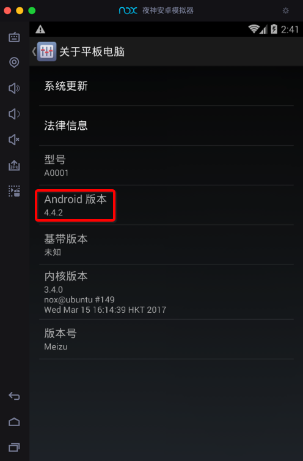
    * 去模拟安卓`4.4.2`
    * `夜神模拟器`已自带`root`
* `Hook框架`
  * 用于后续安装插件去导出`dex`文件
  * 此处选用：`XPosed框架`
    * 在安卓中安装`XPosed`框架
      * 之前已安装`XPosed框架`
        * 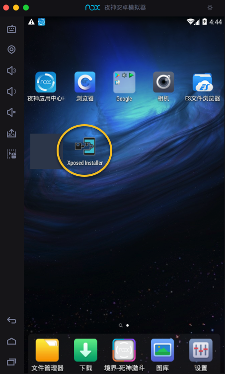
* 要破解的安卓apk
  * 比如`v3.4.8`的小花生的apk：
    * 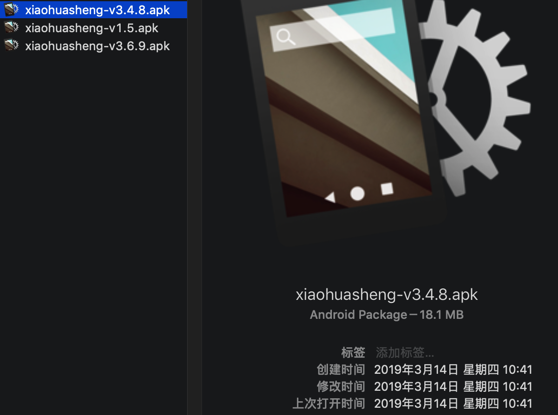
* 下载好`FDex2`的`apk`
  * 从[这里](https://download.csdn.net/download/crifan/11057898)下载到`FDex2_1.1.apk`
    * 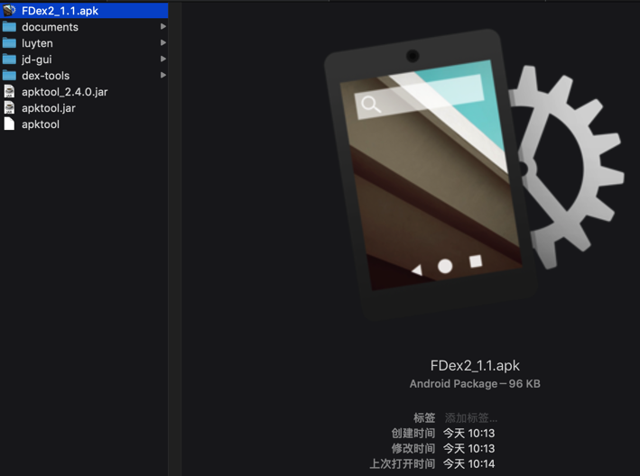

下面以`夜神模拟器` + `XPosed框架`为例解释如何操作。

## 详细步骤

* 安装要破解的apk
  * 把要破解的`apk`安装到`夜神安卓模拟器`中：
  * 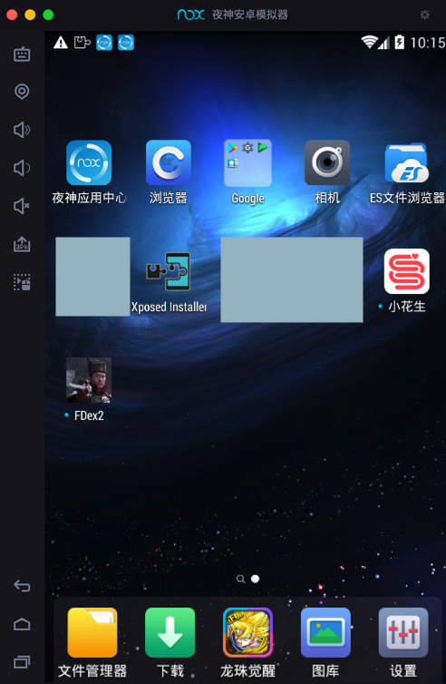
* 安装和激活`FDex2`
  * 安装`FDex2`安装到夜神模拟器中
  * 去XPosed里勾选`激活`FDex2：
  * 
  * 注意：
    * 其会提示：`XPosed模块列表已更新，重启后更改将生效`
    * 所以为了使`FDex2生效`，记得去重启`XPosed`。
  * 此处的版本是`1.1`：
    * 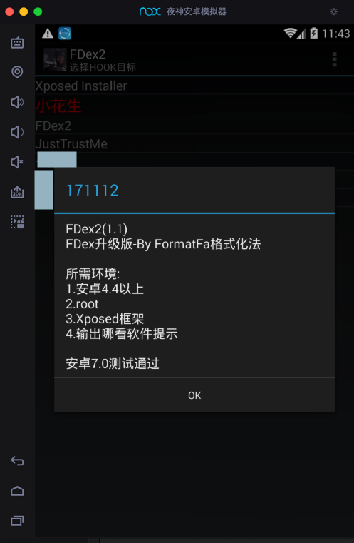
* `FDex2`中设置要处理的app
  * 然后再去打开FDex2，点击此处要破解的app：小花生
  * 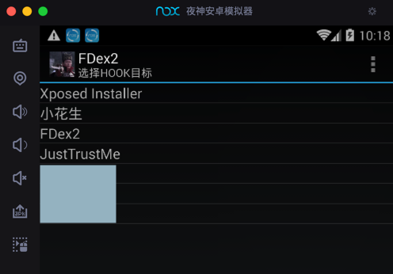
  * 会提示设置成功：
  * > 设置保存成功，请重新打开目标软件，hook包名：com.huili.readingclub
  * > dex输出目录：/data/data/com.huili.readingclub
  * 
* 运行要破解的app
  * 正常去打开和运行要破解的app
  * 
  * 注意：
    * 其实只要打开了：
    * 
    * 稍等几秒，即可
      * 此处内部`FDex2`已经去导出app的所有文件到对应的目录了：`/data/data/com.huili.readingclub`
    * 但是为了更保险，此处再去：随意点击和切换页面，也点击到了要破解的页面，感觉会更好
* 拷贝出已导出的`dex`等文件
  * 所以接着去对应路径
    * 之前`FDex2`设置app时已提示的输出路径
      * `/data/data/com.huili.readingclub`
  * 找dex文件（和其他相关项目文件）：
  * 
  * 并拷贝出来即可

最终拷贝出我们要的dex文件：

```bash
➜  v3.4.8 ll
total 81656
-rw-------  1 crifan  staff   1.1M  3 19 14:05 com.huili.readingclub1166288.dex
-rw-------  1 crifan  staff    12M  3 19 14:04 com.huili.readingclub13088280.dex
-rw-------  1 crifan  staff   1.4M  3 19 14:04 com.huili.readingclub1461452.dex
-rw-------  1 crifan  staff   187K  3 19 14:04 com.huili.readingclub191572.dex
-rw-------  1 crifan  staff   2.7M  3 19 14:04 com.huili.readingclub2847840.dex
-rw-------  1 crifan  staff   3.8M  3 19 14:04 com.huili.readingclub3986968.dex
-rw-------  1 crifan  staff   8.3M  3 19 14:04 com.huili.readingclub8725900.dex
-rw-------  1 crifan  staff   8.4M  3 19 14:04 com.huili.readingclub8825612.dex
```

### 注意和说明

#### 如何从夜神模拟器中导出文件到Mac中

此处使用夜神模拟器自带的`文件管理器`：

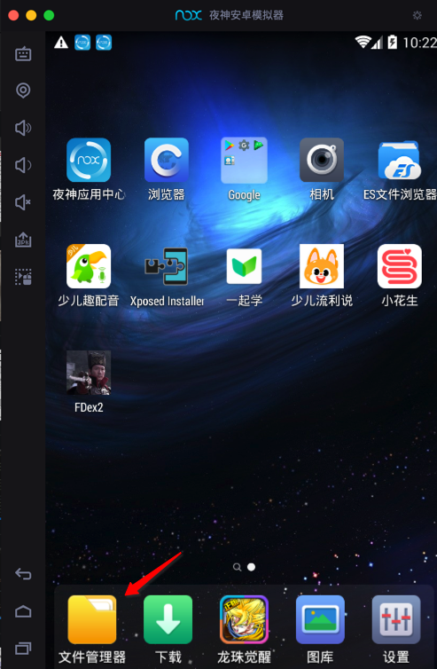

* 详细步骤：
  * 先把导出的文件拷贝到共享目录
    1. 勾选`/data/data/`下面的`com.huili.readingclub`
      * 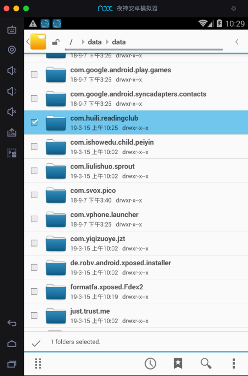
    2. 切换到夜神用于和电脑共享的文件夹`/mnt/shared/Other`中去`操作` -> `粘贴选择项`
      * 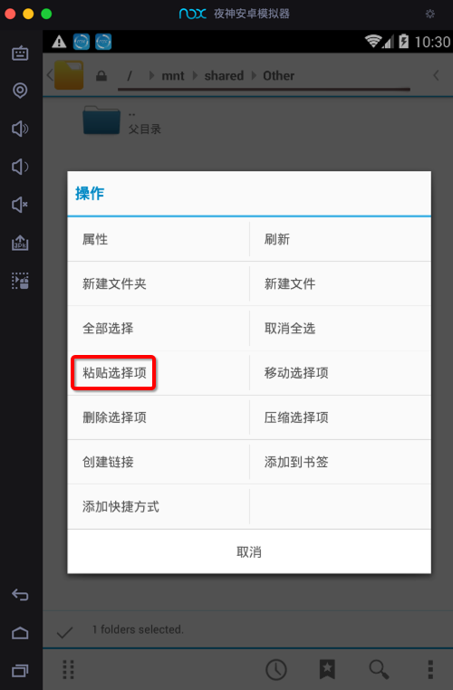
    3. 复制粘贴后，无法立即看到已拷贝的文件。回到上一级目录，再重新进来即可看到：
      * 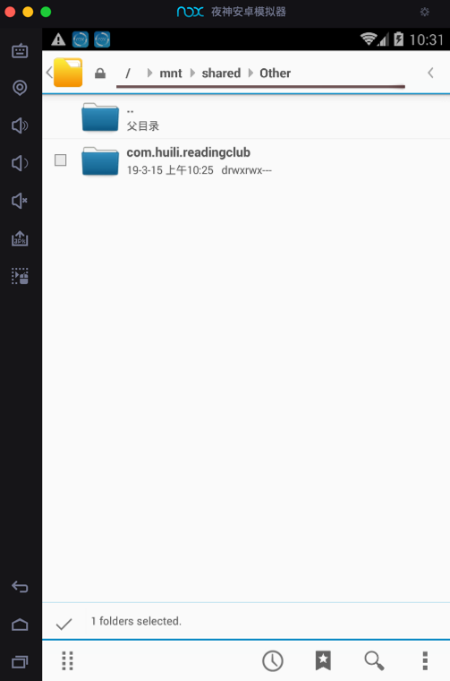
  * 再去到PC（此处Mac）中找到共享根目录，并拷贝文件
    * 夜神模拟器和PC的共享根目录
      * `Windows`：
        * 据说是 `C:\Users\{USERNAME}/Nox_share/Other`
      * `Mac`：
        * `/Users/{用户名}/Library/Application Support/Nox App Player/Nox_share`
        * 举例：
          * `/Users/crifan/Library/Application\ Support/Nox\ App\ Player/Nox_share`
            * 说明：其中空格需要`\`转义
          * 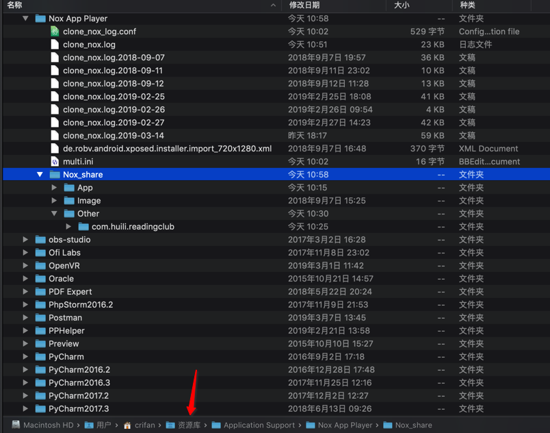

#### 没看到我们要导出的dex文件

1. 有时候没有看到导出文件，则可以重新多试试几次，即可。
2. 有些app（的有些版本），导出的文件中，没有我们希望的（多个dex文件中的某个）包含了app业务逻辑的dex文件
   * 说明该apk采用了更加高级的加固，无法导出我们要的dex文件
   * 举例：
     * 比如小花生的v3.6.9导出的只有一个无效的292B的dex文件：mix.dex
     * 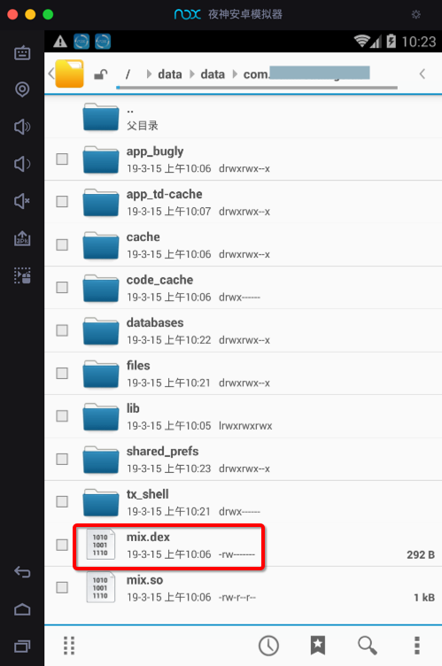
