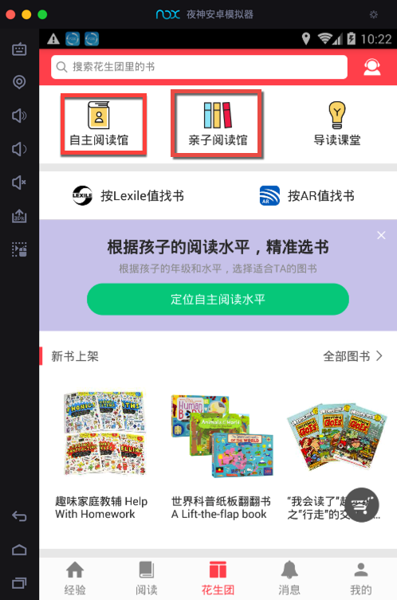

# 破解apk概述

对于从apk破解得到java源代码，目前常见的几种思路：

* 没有加固的
  * 直接一步搞定
    * 用`jadx`从apk导出`java`源码
* 加固了的
  * 前提
    * 后续的hook能够导出dex文件
      * 有些新版本的加固，比如腾讯乐固legu，新版的360加固保，无法导出dex文件
        * 也就无法转换出源码
      * 所用方法：内存dump法
        * 从内存中导出相关dex
  * 分3步
    1. `apk` -> `dex`
    2. `dex` -> `jar`
    3. `jar` -> `java`

下面详细介绍如何操作。

## AndroidManifest.xml

安卓中有个`AndroidManifest.xml`文件，是保存了相关项目的类，资源等配置信息。

而对于安卓的`apk`文件：

* 直接改名为`zip`后再解压：得到的二进制的`AndroidManifest.xml`文件
* 用`apktool`等工具去反编译：得到的是文本格式的`AndroidManifest.xml`文件
  * 就可以看到xml的原始内容了
  * 注：即使`apk`加固了，也可以用`apktool`反编译

### AndroidManifest.xml的作用

得到了xml源码后，可以从其中看到很多有用的信息。

比如， 小花生安卓版 v3.6.9的`apk`，apktool反编译出的`AndroidManifest.xml`中包含：

```xml
<activity android:name="com.huili.readingclub.activity.classroom.SelfReadingActivity" android:screenOrientation="portrait"/>
...
<activity android:name="com.huili.readingclub.activity.classroom.ParentChildReadingActivity" android:screenOrientation="portrait"/>
```

其中的类名：

* activity.classroom.SelfReadingActivity
* activity.classroom.ParentChildReadingActivity

=类的文件名，对应了app界面：



中的：

* 自主阅读馆
* 亲子阅读馆

-》从而有利于后续分析内部的业务逻辑，了解到内部有哪些类和功能。
