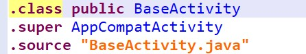
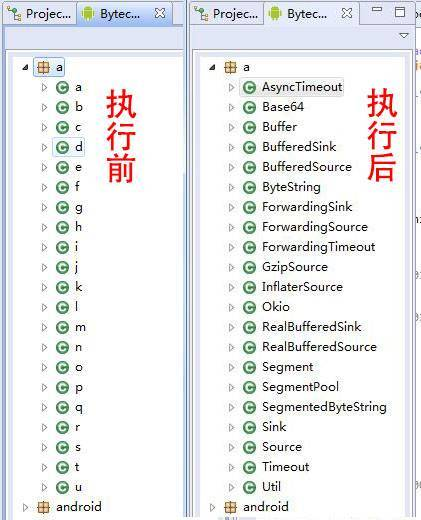
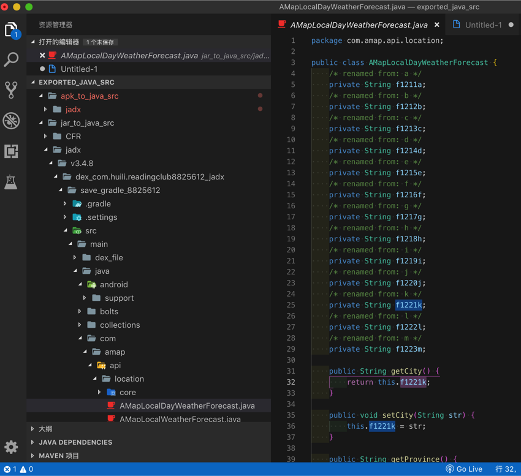

# 如何反混淆

背景：使用反编译工具只能看到混淆之后的代码结构，看不到混淆之前的原始的代码

而如何反混淆：

* 如果有：`mapping.txt`文件
  * 有机会反混淆，恢复和还原出原始代码
  * 背景：
    * 有安卓项目源码的开发者，在折腾ProGuard时，才有（生成）的mapping.txt文件
  * 实际上：作为要破解的人，往往没有
* 如果有：源文件和行号文件
  * 有机会反混淆，恢复和还原出原始代码
  * 背景：
    * 许多APK开发者为了在崩溃时保存源文件类名、行号等信息会在APK混淆时添加以下规则保留源文件信息
    * -keepattributes SourceFile,LineNumberTable
  * 实际上：作为要破解的人，往往没有

## 一些反混淆工具

* JEB=JEB Decompiler
  * JEB2 被称为反混淆神器
  * 官网：
    * https://www.pnfsoftware.com/
  * 一些用于反混淆的插件
    * [S3cuRiTy-Er1C/JebScripts: Jeb public scripts](https://github.com/S3cuRiTy-Er1C/JebScripts)
    * [flankerhqd/jebPlugins: Various Jeb plugins, including obfuscation restore](https://github.com/flankerhqd/jebPlugins)
    * [enovella/jebscripts: A set of JEB Python/Java scripts for reverse engineering Android obfuscated code](https://github.com/enovella/jebscripts)
* Simplify
  * [CalebFenton/simplify: Generic Android Deobfuscator](https://github.com/CalebFenton/simplify)

## 举例

### JEB反混淆效果

如果有了源文件和行号，则可以反混淆：

### Jadx反混淆效果

比如：

详见

[Jadx 如何反混淆deobfuscation](https://book.crifan.org/books/android_app_security_crack/website/android_crack_tool/decompiler/common_decompilers/jadx.html)
