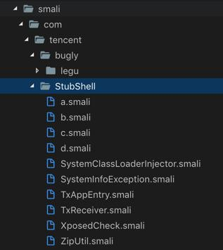
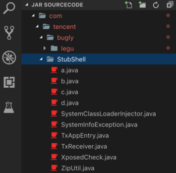
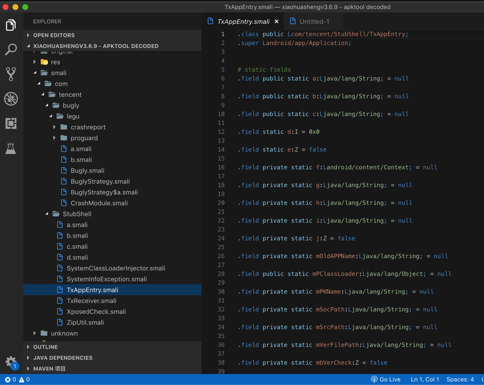
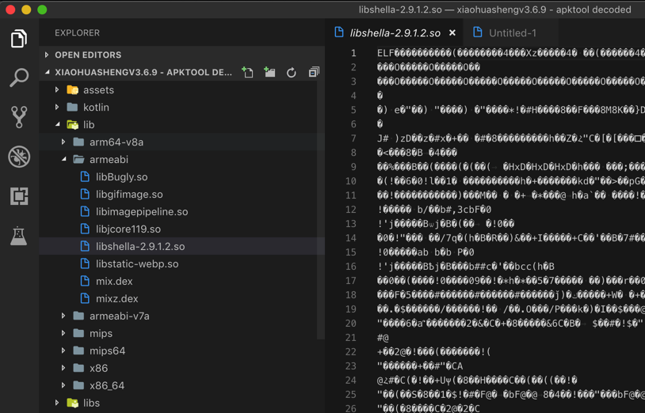
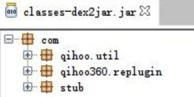
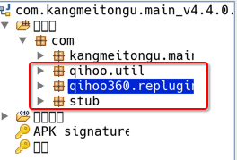

# 如何判断哪家加固方案

通过反编译工具后，从`dex`或`jar`包的目录结构，以及相关的文件（比如`AndroidManifest.xml`）的内容，往往可以看出是哪家的加密方案：

## 腾讯乐固加密后的目录结构和典型内容

腾讯的`乐固legu`加密加壳后的apk，（去用`apktool`）反编译后得到的`jar`包的典型目录结构是：

* 图
  * 
  * 
  * 
    * 
* 文字
  * 核心文件夹
    * com
      * tencent
        * bugly
          * legu
            * crashreport
            * proguard
        * StubShell
          * TxAppEntry
  * 详细的目录结构和文件
    ```bash
    ➜  tencent ll
    total 0
    drwxr-xr-x  12 crifan  staff   384B  3 14 13:39 StubShell
    drwxr-xr-x   3 crifan  staff    96B  3 14 13:39 bugly
    ➜  tencent tree .
    .
    ├── StubShell
    │   ├── SystemClassLoaderInjector.smali
    │   ├── SystemInfoException.smali
    │   ├── TxAppEntry.smali
    │   ├── TxReceiver.smali
    │   ├── XposedCheck.smali
    │   ├── ZipUtil.smali
    │   ├── a.smali
    │   ├── b.smali
    │   ├── c.smali
    │   └── d.smali
    └── bugly
        └── legu
            ├── Bugly.smali
            ├── BuglyStrategy$a.smali
            ├── BuglyStrategy.smali
            ├── CrashModule.smali
            ├── a.smali
            ├── b.smali
            ├── crashreport
            │   ├── BuglyHintException.smali
            │   ├── BuglyLog.smali
            │   ├── CrashReport$CrashHandleCallback.smali
            │   ├── CrashReport$UserStrategy.smali
            │   ├── CrashReport.smali
            │   。。。
            │   └── inner
            │       └── InnerAPI.smali
            └── proguard
                ├── a.smali
                ├── 。。。
                └── z.smali
    14 directories, 123 files
    ➜  lib tree .
    .
    ├── arm64-v8a
    │   ├── libBugly.so
    │   ├── libgifimage.so
    │   ├── libimagepipeline.so
    │   ├── libjcore119.so
    │   ├── libshella-2.9.1.2.so
    │   └── libstatic-webp.so
    ├── armeabi
    │   ├── libBugly.so
    │   ├── libgifimage.so
    │   ├── libimagepipeline.so
    │   ├── libjcore119.so
    │   ├── libshella-2.9.1.2.so
    │   ├── libstatic-webp.so
    │   ├── mix.dex
    │   └── mixz.dex
    ├── armeabi-v7a
    │   ├── libBugly.so
    │   ├── libgifimage.so
    │   ├── libimagepipeline.so
    │   ├── libjcore119.so
    │   ├── libshella-2.9.1.2.so
    │   └── libstatic-webp.so
    ├── 。。。
    7 directories, 36 files
    ```

反编译出的`AndroidManifest.xml`内容：

```xml
<application android:allowBackup="true" android:icon="@drawable/app_logo" android:label="@string/app_name" android:name="com.tencent.StubShell.TxAppEntry" android:supportsRtl="true" android:theme="@style/AppTheme">
<meta-data android:name="TxAppEntry" android:value="com.huili.readingclub.MyApplication"/>
```

中有：

* `android:name="com.tencent.StubShell.TxAppEntry"`
  * 其中有：
    * `com.tencent.StubShell.TxAppEntry`
* `<meta-data android:name="TxAppEntry"`

也是典型的腾讯乐固的内容。

## 360加固保的加固的目录结构

360加固后的`apk`经过`dex2jar`反编译后的目录结构是：





* `com.qihoo.util`
* `com.qihoo360.replugin`
* `com.stub`

这种结构就说明是360加固保加固的。
