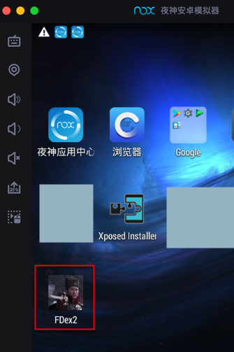
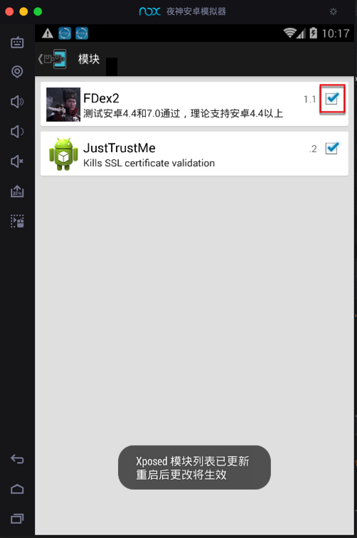
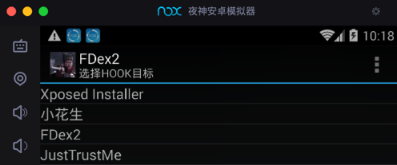
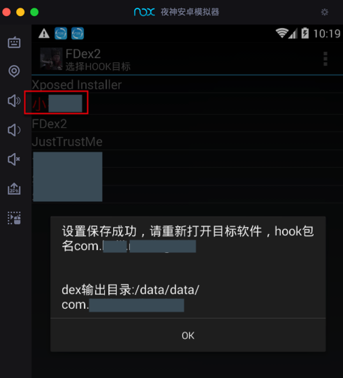
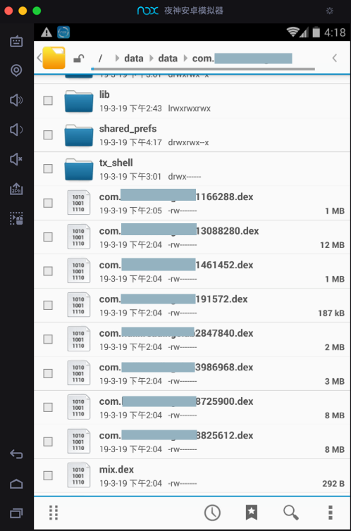

# FDex2

* `FDex2`
  * 是什么：[XPosed](https://book.crifan.com/books/crack_assistant_xposed_framework/website/)的一个插件
  * 功能：用来从`运行中的安卓app`中导出`dex`文件
  * 下载
    * 百度网盘
      * 链接: https://pan.baidu.com/s/1lTF8CN96bxWpFwv7J174lg 提取码: 3e3t
    * CSDN
      * [脱壳工具 FDex2-CSDN下载](https://download.csdn.net/download/crifan/11057898)

## 如何使用FDex2

### 安装FDex2（这个安卓apk）

下载得到`96KB`的apk文件：`FDex2_1.1.apk`

先安装到安卓设备中，比如此处的[Nox夜神模拟器](https://book.crifan.com/books/good_android_emulator_nox/website/)：

### Xposed中激活FDex2

再去打开`Xposed`，勾选=激活`FDex2`：

* 注意
  * 其会提示：`XPosed模块列表已更新，重启后更改将生效`
  * 所以为了使`FDex2生效`，记得去重启`XPosed`

### 运行FDex2，点选要破解的app

再去打开`FDex2`，会看到一个（当前安卓系统已安装的）app的列表：

然后点击对应的，你要破解导出dex的app，比如此处的：`小花生`。

被选中的app名字会变红色，且会弹框提示你包名和保存（导出dex文件的）路径：

> 设置保存成功，请重新打开目标软件，hook包名：com.huili.readingclub
> 
> dex输出目录：/data/data/com.huili.readingclub

### 运行要破解的app

再去点击运行被破解的app（此处的 小花生）

正常来说：只要打开了app，稍等几秒（等待FDex2内部的计算和导出保存dex文件的操作），即可完成dex的导出

比如进入了小花生的主页：

稍等几秒，即可。

但是为了更保险，此处可以去，随意点击和切换页面，感觉会更好。

### 去对应目录找导出dex文件

此处内部逻辑是：

`FDex2`正在导出app的所有dex文件到对应的目录了：`/data/data/com.huili.readingclub`

后续（Nox中用`文件管理器`）去打开对应目录，即可看到希望得到的（多个）dex文件：

