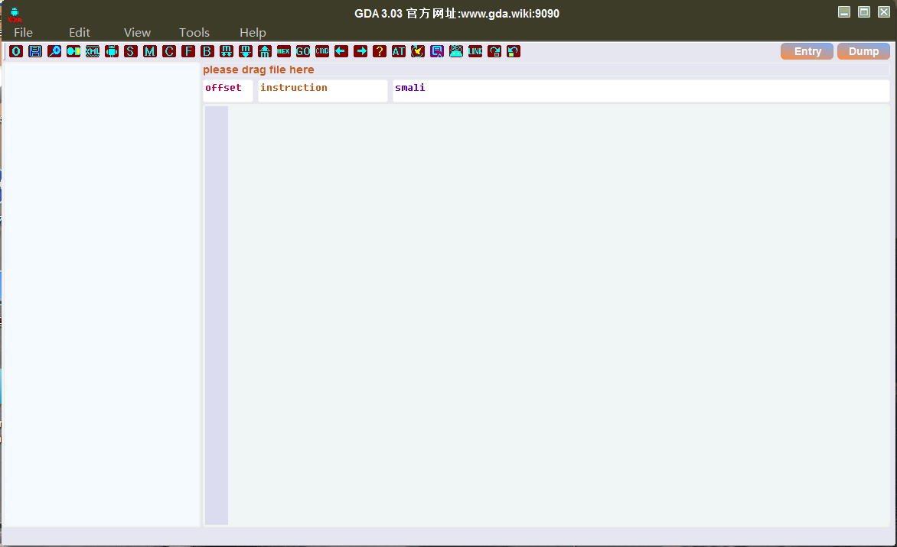
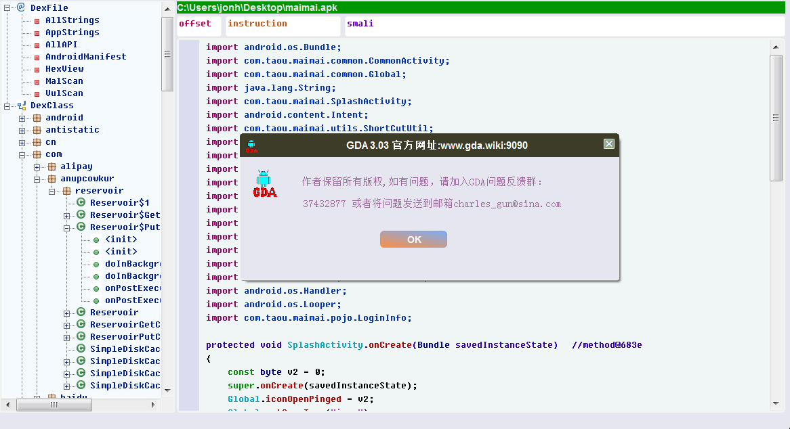
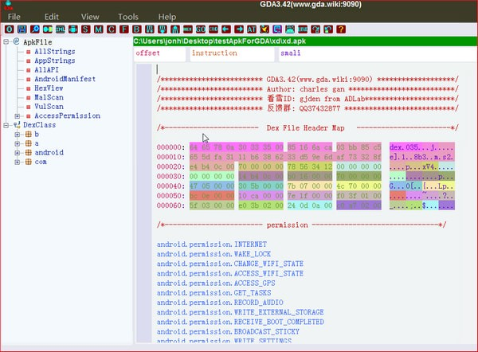
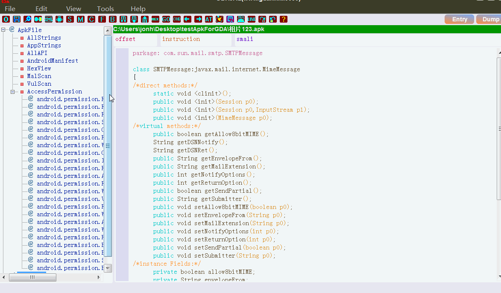
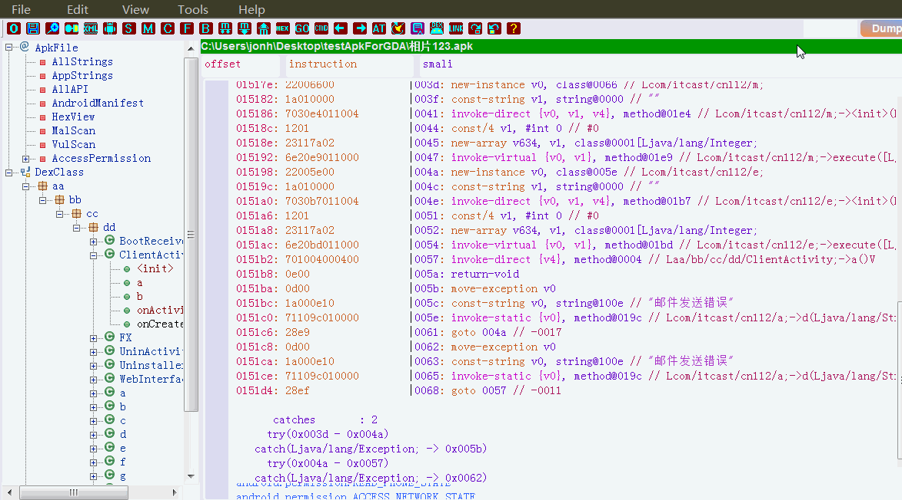
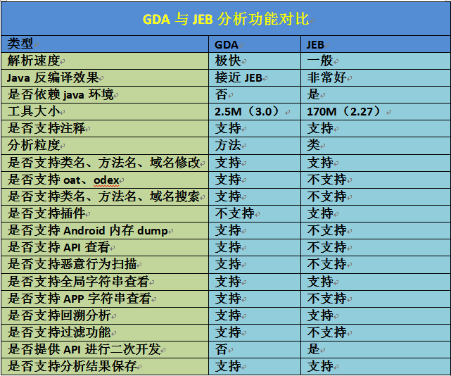

# GDA

* `GDA`=`GJoy Dex Analysizer`=GDA反编译器
* 主页
  * [GDA主页-功能强大的交互式Android反编译分析工具](http://www.gda.wiki:9090)
* 下载
  * [GDA下载 最新版](http://www.gda.wiki:9090/down.php)
* 功能
  * 一款强大而轻便的交互式反编译器，也是一款综合性逆向分析利器
    * 支持分析apk，dex，odex，oat类型文件
    * 支持python脚本以及方法签名制作与识别
  * 工具包含三个由作者独立完成的高速解析引擎
    * 反编译引擎
    * apk壳检测引擎
    * 恶意行为检测引擎
  * 再加上作者独创的使用了字节码直接转java伪代码的解析方式
    * 无需转换成smali汇编后在做反编译
      * 大大提升了解析速度
* 特点
  * 无需安装java环境和android环境就可以使用
    * 不是依赖其他的（很多安卓反汇编的、java的）库
  * 分析速度快、体积小、内存占用少
* 截图
  * 
  * 
  * 
  * 
  * 
* GDA vs JEB
  * 