# jadx

* 主页
  * [skylot/jadx: Dex to Java decompiler](https://github.com/skylot/jadx)
* 功能
  * 从`dex`或`apk`文件中转换出`java`源代码的反编译器
* 两种模式/版本
  * `命令行`版本=`command line version`：`jadx`
  * `图形界面`版本=`GUI`=`graphical version`：`jadx-gui`=`JadxGUI`
    * -> 注意：很多人往往把`jadx-gui`简称为`jadx`
    * 截图
      * 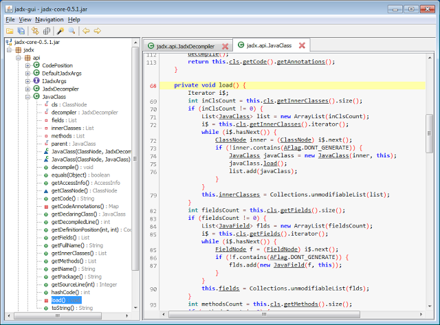

## 下载jadx

从[jadx的release页面](https://github.com/skylot/jadx/releases)，可下载到最新版的`jadx`

比如此处是：`jadx-1.2.0.zip`

解压后，可以得到：

* 命令行：`jadx-1.2.0/bin/jadx`
* GUI图形界面：`jadx-1.2.0/bin/jadx-gui`

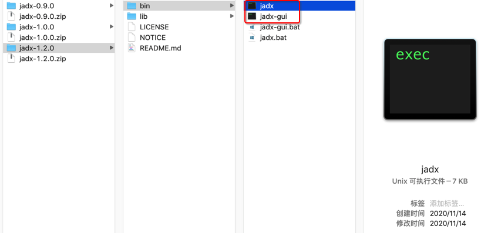

## jadx使用说明

### 命令行：`jadx`

* 命令行：`jadx`
  * 处理`apk`文件
    * 语法
      ```bash
      jadx -d output_folder your_apk_file.apk
      ```
    * 举例
      ```bash
      jadx/jadx-0.9.0/bin/jadx -d from_jadx_command xiaohuasheng-v1.5.apk
      jadx/jadx-0.9.0/bin/jadx -d exported_java_src mafengwo_ziyouxing.apk
      ```
    * 详见
      * [一步: apk->java · 安卓应用的安全和破解](https://book.crifan.com/books/android_app_security_crack/website/android_crack_tech/how_apk_to_java_src/1_step_apk_to_java.html)
  * 处理`dex`
    * 语法
        ```bash
        jadx -d output_folder your_dex_file.dex
        ```
    * 举例
      ```bash
      jadx-0.9.0/bin/jadx some_dex_file.dex -d .
      jadx-1.0.0/bin/jadx com.ishowedu.child.peiyin8392664.dex -d com.ishowedu.child.peiyin8392664_java
      ```
    * 详见：
        * [2.1 dex转java · 安卓应用的安全和破解](https://book.crifan.com/books/android_app_security_crack/website/android_crack_tech/how_apk_to_java_src/2_or_3_steps/2_1_dex_to_java.html)

### GUI：`jadx-gui`

使用方式：双击`bin/jadx-gui`，即可打开界面

详见：[jadx gui图形界面版](https://book.crifan.com/books/android_app_security_crack/website/android_crack_tech/how_apk_to_java_src/1_step_apk_to_java.html#jadx-gui%E5%9B%BE%E5%BD%A2%E7%95%8C%E9%9D%A2%E7%89%88)

#### 用`jadx-gui`导出全部代码

`文件 -> 全部保存`

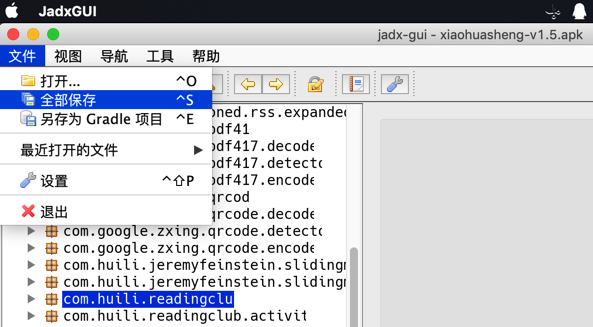

即可下载到：

* 各种资源：`resources`
* 源码：`sources`
  * 其中的`sources`，和`文件 -> 另存为Gradle项目`所导出的代码是一样的

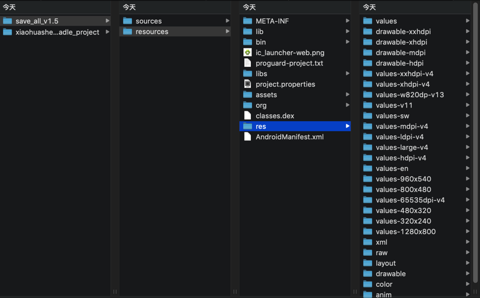

其中就有我们希望的app的业务逻辑的代码：

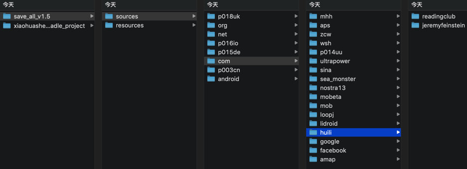

### 从`jadx-gui`打开的结构看出是否加固和是哪家的加固

对于某个安卓的apk，用`jadx-gui`打开不同版本的apk的效果是：

* v1.5
  * 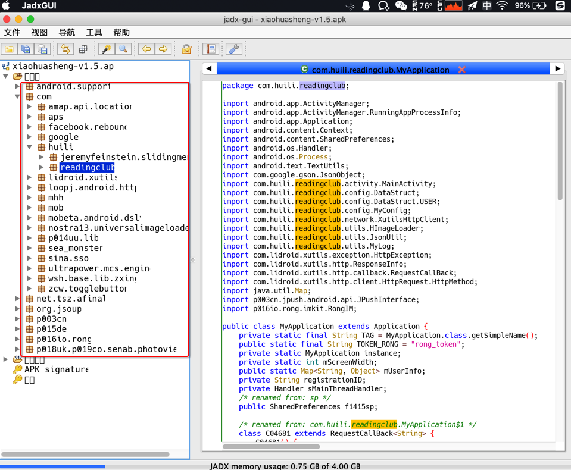
* v3.4.8
  * 
* v3.6.9
  * 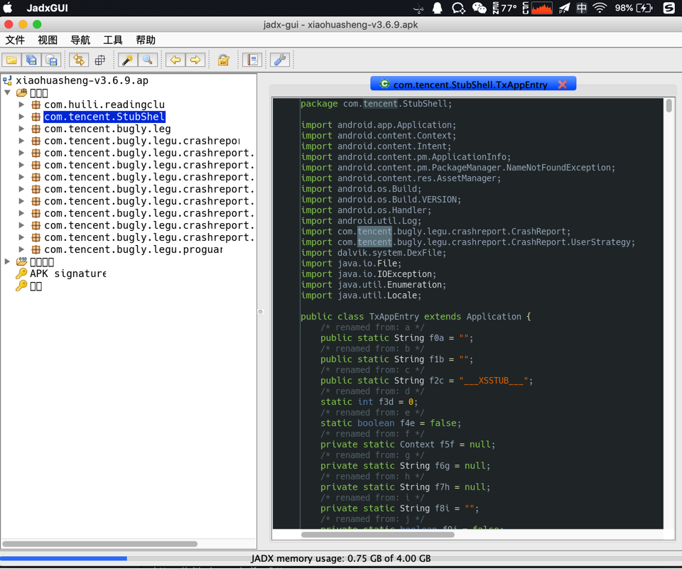

-》

可以看出apk是否被加固以及用了何种加固方案：

* `v1.5`：没有被加固
* `v3.4.8`：加固方案 qihoo奇虎360
* `v3.6.9`：加固方案 腾讯乐固legu

## `jadx`的help帮助信息=语法参数

```bash
 bin/jadx --help

jadx - dex to java decompiler, version: 1.2.0

usage: jadx [options] <input files> (.apk, .dex, .jar, .class, .smali, .zip, .aar, .arsc)
options:
  -d, --output-dir                    - output directory
  -ds, --output-dir-src               - output directory for sources
  -dr, --output-dir-res               - output directory for resources
  -r, --no-res                        - do not decode resources
  -s, --no-src                        - do not decompile source code
  --single-class                      - decompile a single class
  --output-format                     - can be 'java' or 'json', default: java
  -e, --export-gradle                 - save as android gradle project
  -j, --threads-count                 - processing threads count, default: 4
  --show-bad-code                     - show inconsistent code (incorrectly decompiled)
  --no-imports                        - disable use of imports, always write entire package name
  --no-debug-info                     - disable debug info
  --no-inline-anonymous               - disable anonymous classes inline
  --no-replace-consts                 - don't replace constant value with matching constant field
  --escape-unicode                    - escape non latin characters in strings (with \u)
  --respect-bytecode-access-modifiers - don't change original access modifiers
  --deobf                             - activate deobfuscation
  --deobf-min                         - min length of name, renamed if shorter, default: 3
  --deobf-max                         - max length of name, renamed if longer, default: 64
  --deobf-rewrite-cfg                 - force to save deobfuscation map
  --deobf-use-sourcename              - use source file name as class name alias
  --deobf-parse-kotlin-metadata       - parse kotlin metadata to class and package names
  --rename-flags                      - what to rename, comma-separated, 'case' for system case sensitivity, 'valid' for java identifiers, 'printable' characters, 'none' or 'all' (default)
  --fs-case-sensitive                 - treat filesystem as case sensitive, false by default
  --cfg                               - save methods control flow graph to dot file
  --raw-cfg                           - save methods control flow graph (use raw instructions)
  -f, --fallback                      - make simple dump (using goto instead of 'if', 'for', etc)
  -v, --verbose                       - verbose output (set --log-level to DEBUG)
  -q, --quiet                         - turn off output (set --log-level to QUIET)
  --log-level                         - set log level, values: QUIET, PROGRESS, ERROR, WARN, INFO, DEBUG, default: PROGRESS
  --version                           - print jadx version
  -h, --help                          - print this help
Example:
  jadx -d out classes.dex
```

## 常见问题

## Jadx中如何反混淆`deobfuscation`

此处暂时没有找到，反混淆前后对比效果明显的例子。

暂时只能随便找了个效果不明显的，用于解释如何开启和关闭反混淆。

如下：

不带反混淆：

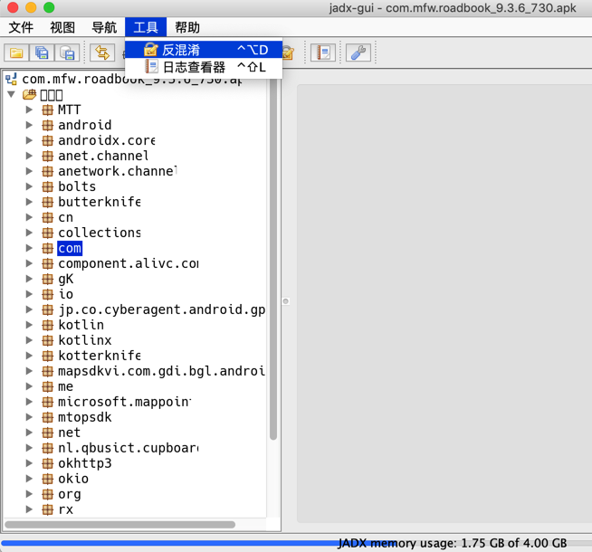

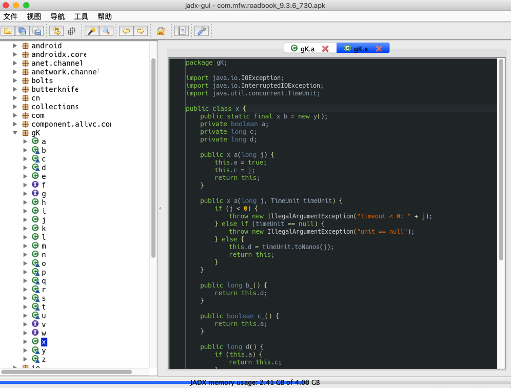

都是a,b,c,d,j,等变量名

启用反混淆：

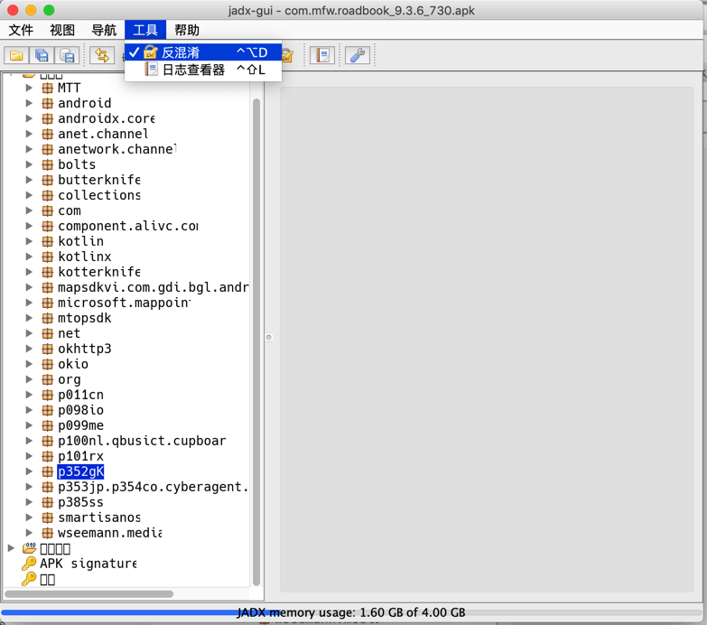

之前的gK,io等，就反混淆了：

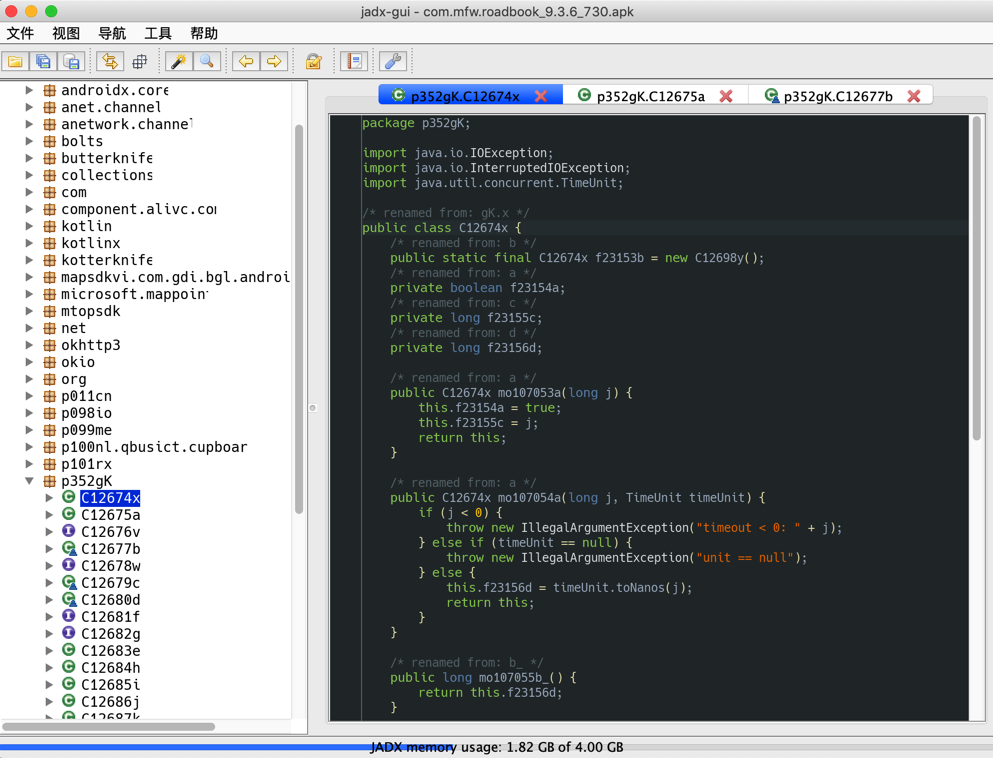

变量名改为了：f23154a，f23155c，虽然反混淆后的效果很一般，但是至少比a,b,c更容易看懂一些。

### jadx转换出错：java.lang.OutOfMemoryError

如果用`jadx`转换代码期间出错：

```bash
java.lang.OutOfMemoryError: GC overhead limit exceeded
    at jadx.core.dex.visitors.blocksmaker.BlockProcessor.computeDominators(BlockProcessor.java:189)
    at jadx.core.dex.visitors.blocksmaker.BlockProcessor.processBlocksTree(BlockProcessor.java:52)
    at jadx.core.dex.visitors.blocksmaker.BlockProcessor.visit(BlockProcessor.java:42)
    at jadx.core.dex.visitors.DepthTraversal.visit(DepthTraversal.java:27)
    at jadx.core.dex.visitors.DepthTraversal.lambda$visit$1(DepthTraversal.java:14)
    at jadx.core.dex.visitors.DepthTraversal$$Lambda$19/469590976.accept(Unknown Source)
    at java.util.ArrayList.forEach(ArrayList.java:1249)
    at jadx.core.dex.visitors.DepthTraversal.visit(DepthTraversal.java:14)
    at jadx.core.ProcessClass.process(ProcessClass.java:32)
    at jadx.api.JadxDecompiler.processClass(JadxDecompiler.java:292)
    at jadx.api.JavaClass.decompile(JavaClass.java:62)
    at jadx.api.JadxDecompiler.lambda$appendSourcesSave$0(JadxDecompiler.java:200)
    at jadx.api.JadxDecompiler$$Lambda$13/1425454633.run(Unknown Source)
    at java.util.concurrent.ThreadPoolExecutor.runWorker(ThreadPoolExecutor.java:1142)
    at java.util.concurrent.ThreadPoolExecutor$Worker.run(ThreadPoolExecutor.java:617)
    at java.lang.Thread.run(Thread.java:745)
...
```

且同时伴有：

* CPU占用率很高
* 内存消耗也很大
  * 比如此处JadxCLI占用了4G的内存
    * 

就是典型的：`OOM`=`Out Of Memory`的问题了。

解决办法，有两种：

* 增加JVM最大内存
  * 逻辑：修改`jadx`脚本，增大`-Xmx`的值
  * 步骤：
    * 编辑`jadx-0.9.0/bin/jadx`，找到`DEFAULT_JVM_OPTS`的配置，修改其中`-Xmx`的值
    * 比如把此处的
      ```bash
      DEFAULT_JVM_OPTS='"-Xms128M" "-Xmx4g"'
      ```
    * 改为：
      ```bash
      DEFAULT_JVM_OPTS='"-Xms128M" "-Xmx6g"'
      ```
    * 即表示，把JVM最大内存，从之前的`4G`，增大到`6G`
    * 这样就运行`jadx`使用更多的内存，从而降低或消除`OOM`的问题了
* 减少线程数
  * 逻辑：通过`-j N`，N=1/2之类，减少进程数，从而降低内存占用，减少OOM的概率
  * 步骤：
    * 在命令行运行jadx时，传递`-j`参数，指定线程数，比如
      ```bash
      jadx -d output_folder -j 1 your_apk.apk
      ```
  * 缺点
    * 处理速度会有所降低
      * 因为默认`4`线程处理，反编译等速度会比较快
      * 线程数减少后，反编译等速度可能会有所影响

说明：

* 一般反编译小的不复杂的`apk`或`dex`，不会遇到`OOM`问题
* 反编译比较大型的，比较复杂的`apk`或`dex`，才可能会遇到`OOM`
  * 比如之前 [用jadx反编译马蜂窝](http://www.crifan.com/try_crack_android_apk_mafengwo_to_get_java_sourcecode) 遇到了`OOM`
