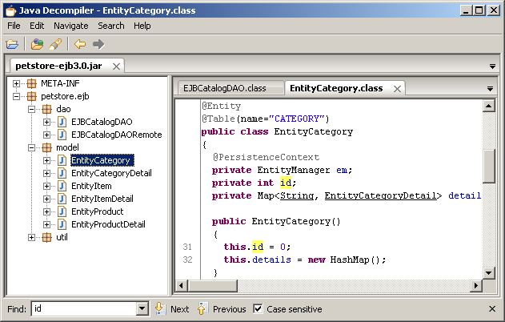
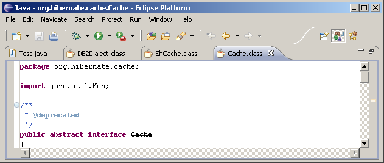
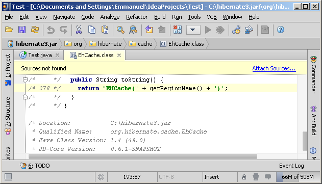

# JD-GUI

* 主页
  * [Java Decompiler](http://java-decompiler.github.io)
* JD Project=Java Decompiler project
  * `JD-Core`
    * 是什么：`一个库`
    * 功能：从一个或多个.class文件中重构java源代码
    * 用途：
      * 可用于恢复丢失的源代码
      * 可用于查看jar包的java源码=查看JRE（Java运行时）库的源码
    * 特点：
      * java 5中最新的功能
        * 注释annotations
        * generics 或 枚举类
    * 说明：
      * JD-GUI内置包含了JD-Core
      * JD-Eclipse内置包含了JD-Core
  * `JD-GUI`
    * 是什么：一个独立的带图形界面的`程序`
    * 作用：显示查看jar包的java源代码
      * 注：`jar包`=内部包含了很多`.class`文件的，被压缩打包成`jar`
    * 举例
      * 
    * github主页
      * [java-decompiler/jd-gui: A standalone Java Decompiler GUI](https://github.com/java-decompiler/jd-gui)
    * 下载
      * http://java-decompiler.github.io
      * -》
      * [Releases · java-decompiler/jd-gui](https://github.com/java-decompiler/jd-gui/releases)
      * -》
      * 比如：
        * `Mac`：
          * [jd-gui-osx-1.4.1.tar](https://github.com/java-decompiler/jd-gui/releases/download/v1.4.1/jd-gui-osx-1.4.1.tar)
  * 插件
    * JD-Eclipse：Eclipse的插件
      * 举例：
        * 
    * JD-IntelliJ：IntelliJ IDEA的插件
      * 举例：
        * 
