# `JD-GUI` vs `CFR` vs `Procyon` vs `Jadx`

对于同一个jar包：`com.huili.readingclub.jar`

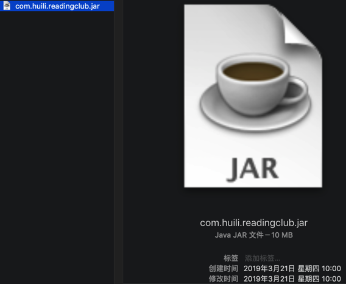

用不同工具：

* JD-GUI
* CFR
* Procyon
* Jadx

去导出java源代码后，转换导出的效果，尤其是准确性，是否出错，是不一样的。

## 转换的细节是否完美

jd-gui的细节不够好的地方：

static函数：

```java
  static
  {
    lock = new ReentrantLock();
  }
```

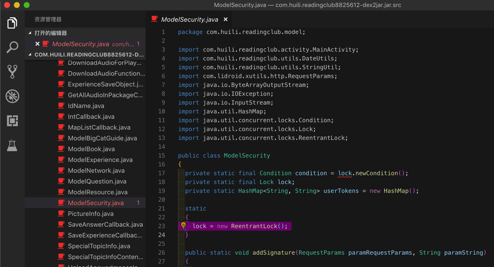

而CFR、Procyon、Jadx转换结果可以更完整：

CFR的：

```java
    static {
        userTokens = new HashMap();
        lock = new ReentrantLock();
        condition = lock.newCondition();
    }
```

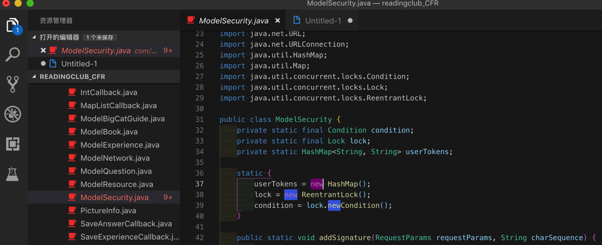

Procyon

```java
    static {
        ModelSecurity.userTokens = new HashMap<String, String>();
        lock = new ReentrantLock();
        condition = ModelSecurity.lock.newCondition();
    }
```

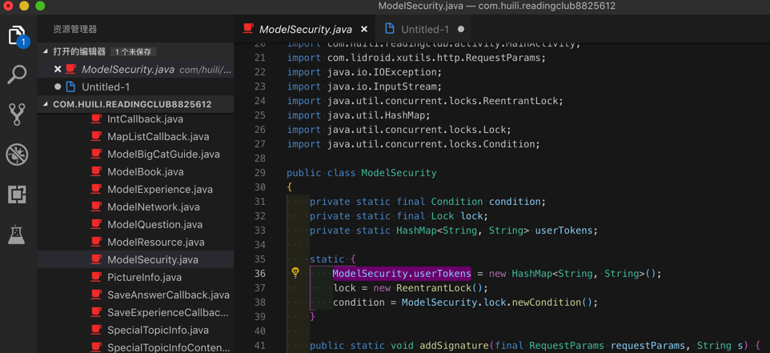

Jadx

```java
public class ModelSecurity {
    private static final Condition condition = lock.newCondition();
    private static final Lock lock = new ReentrantLock();
    private static HashMap<String, String> userTokens = new HashMap();
}
```

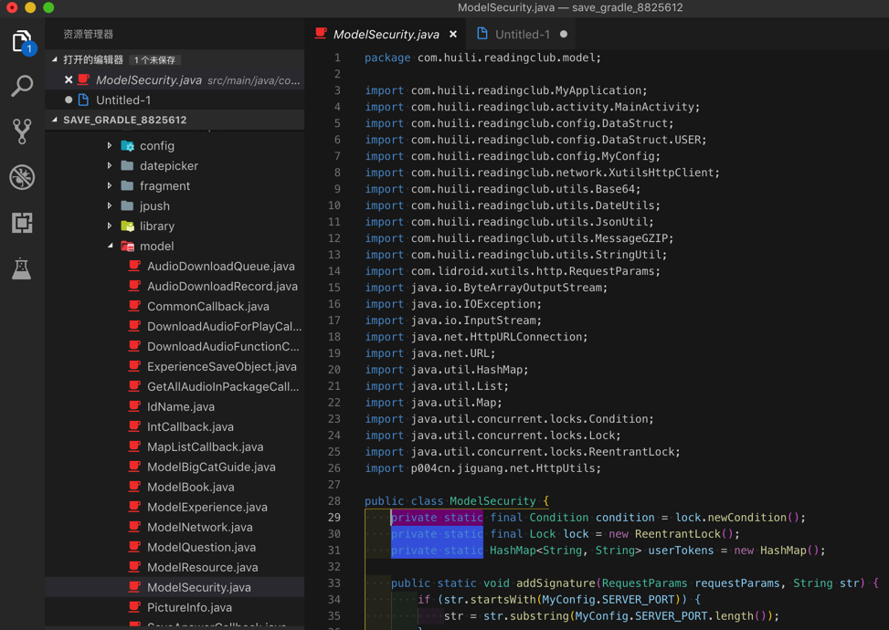

很明显从：

* CFR的：`userTokens = new HashMap();`
* Procyon的：`ModelSecurity.userTokens = new HashMap<String, String>();`
* Jadx的：`private static HashMap<String, String> userTokens = new HashMap();`

可以看出：

* `Procyon`能识别static变量，细节转换的很完美和精确
* 而`Jadx`：更进一步识别出是private的static类型的变量，更加准确。

对于细节转换的结论：

* `JD-GUI`：细节不够好
* `CFR`：细节基本满足要求
* `Procyon`：细节完美转换
* `Jadx`：不仅完美且代码变量和结构更合理

## 转换是否出错及代码逻辑清晰度

### getToken函数转换效果

比如：`com.huili.readingclub.model.ModelSecurity`的`getToken`

JD-GUI某函数转换报错得不到源码

都是错误代码：

```java
  /* Error */
  private static String getToken(String paramString)
  {
    // Byte code:
    //   0: aload_0
    //   1: invokestatic 81    com/huili/readingclub/utils/StringUtil:isNullOrEmpty    (Ljava/lang/String;)Z
    //   4: ifeq +5 -> 9
    //   7: aconst_null
    //   8: areturn
    //   9: aload_0
    //   10: invokestatic 87    java/lang/Integer:parseInt    (Ljava/lang/String;)I
    //   13: iconst_1
    //   14: if_icmpge +5 -> 19
    //   17: aconst_null
    //   18: areturn
    //   19: getstatic 22    com/huili/readingclub/model/ModelSecurity:userTokens    Ljava/util/HashMap;
    //   22: aload_0
......
```

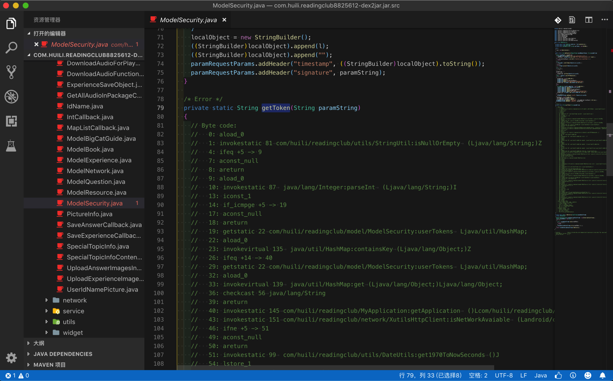

CFR某函数转换报错但有源码

转换报错：

summary.txt

```bash
com.huili.readingclub.model.ModelSecurity
----------------------------
getToken(java.lang.String )
  Loose catch block
run()
  Loose catch block
```

代码中有报错：

```java
    /*
     * WARNING - Removed back jump from a try to a catch block - possible behaviour change.
     * Loose catch block
     * Enabled aggressive block sorting
     * Enabled unnecessary exception pruning
     * Enabled aggressive exception aggregation
     * Lifted jumps to return sites
     */
    private static String getToken(final String string2) {
        ......
        lock.lock();
        Runnable runnable = new Runnable((String)charSequence){
            ......
            /*
             * WARNING - Removed back jump from a try to a catch block - possible behaviour change.
             * Loose catch block
             * Enabled aggressive block sorting
             * Enabled unnecessary exception pruning
             * Enabled aggressive exception aggregation
             * Lifted jumps to return sites
             */
            @Override
            public void run() {
                Throwable throwable2222;
```

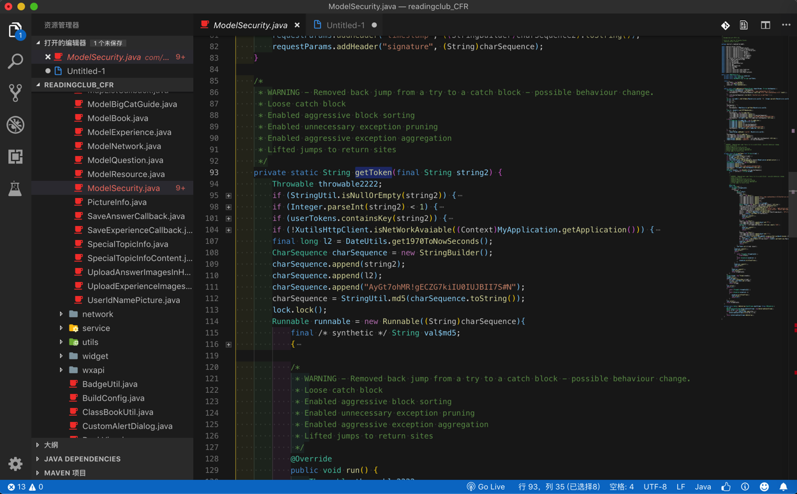

Procyon某函数完美转换无错误：

```java
// 
// Decompiled by Procyon v0.5.34
// 
    private static String getToken(String s) {
        if (StringUtil.isNullOrEmpty(s)) {
            return null;
        }
        ...
        sb.append("AyGt7ohMR!gECZG7kiIU0IUJBII7S#N");
        ModelSecurity.lock.lock();
        try {
            try {
                new Thread(new Runnable() {
                    @Override
                    public void run() {
                        ModelSecurity.lock.lock();
                        try {
                            try {
                                final StringBuilder sb = new StringBuilder();
                                ...
                                sb.append("/");
```

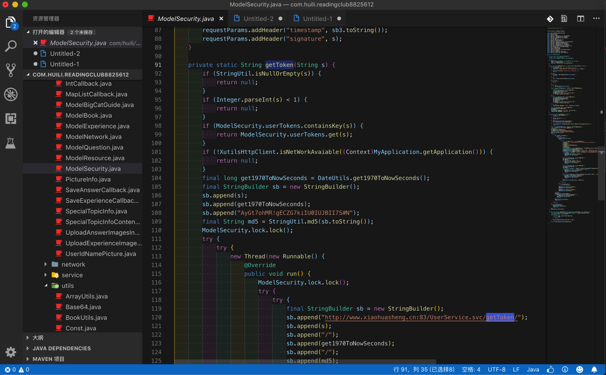

Jadx某函数完美转换外，还保持代码变量和结构更合理 -> 能识别常量定义和引用

```java
    private static String getToken(final String str) {
        if (StringUtil.isNullOrEmpty(str) || Integer.parseInt(str) < 1) {
            return null;
        }
        ......
        stringBuilder.append(MyConfig.SECRET_KEY);
        final String md5 = StringUtil.md5(stringBuilder.toString());
        lock.lock();
        try {
            new Thread(new Runnable() {
                public void run() {
                    ModelSecurity.lock.lock();
                    try {
                        StringBuilder stringBuilder = new StringBuilder();
                        ...
                        stringBuilder.append(HttpUtils.PATHS_SEPARATOR);
```

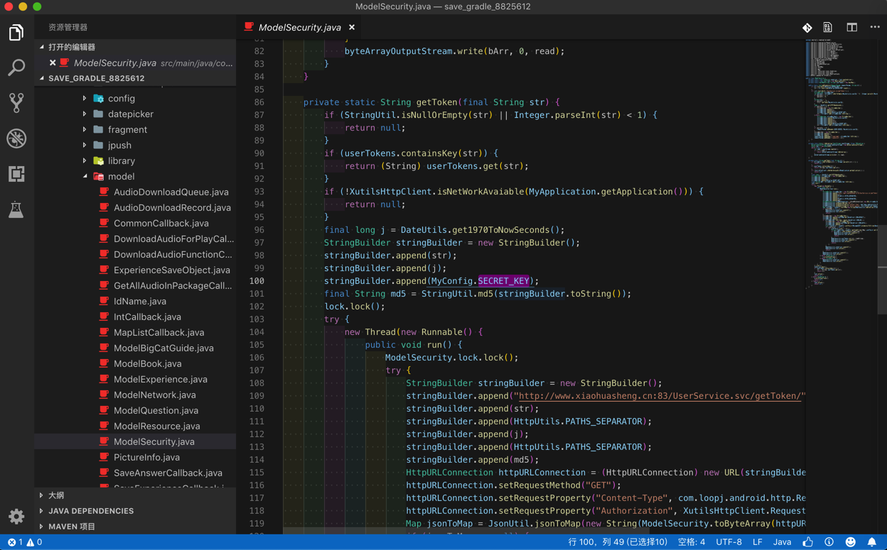

其中包括`stringBuilder.append`的参数是

常量定义`MyConfig.SECRET_KEY`

而不是之前代码的常量的值：

`"AyGt7ohMR!gECZG7kiIU0IUJBII7S#N"`

### `getMD5Str`的`char`的`list`转换效果

另外，再去对比：

Jadx导出的代码的逻辑和结构，非常清晰：

char的list很清楚，以及赋值语句：

```java
cArr2[i] = cArr[(b >> 4) & 15];
```

也容易看懂

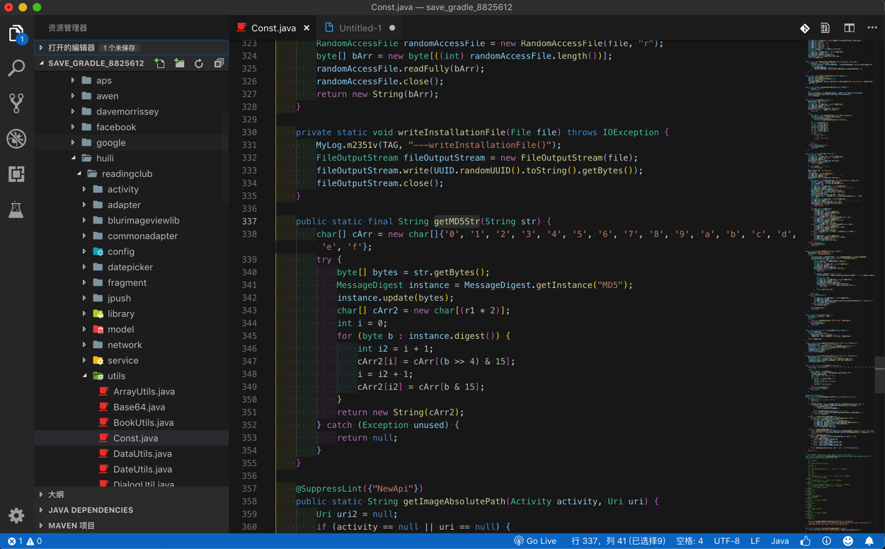

```java
    public static final String getMD5Str(String str) {
        char[] cArr = new char[]{'0', '1', '2', '3', '4', '5', '6', '7', '8', '9', 'a', 'b', 'c', 'd', 'e', 'f'};
        try {
            byte[] bytes = str.getBytes();
            MessageDigest instance = MessageDigest.getInstance("MD5");
            instance.update(bytes);
            char[] cArr2 = new char[(r1 * 2)];
            int i = 0;
            for (byte b : instance.digest()) {
                int i2 = i + 1;
                cArr2[i] = cArr[(b >> 4) & 15];
                i = i2 + 1;
                cArr2[i2] = cArr[b & 15];
            }
            return new String(cArr2);
        } catch (Exception unused) {
            return null;
        }
    }
```

而不是像：

Procyon（的Luyten）的代码：

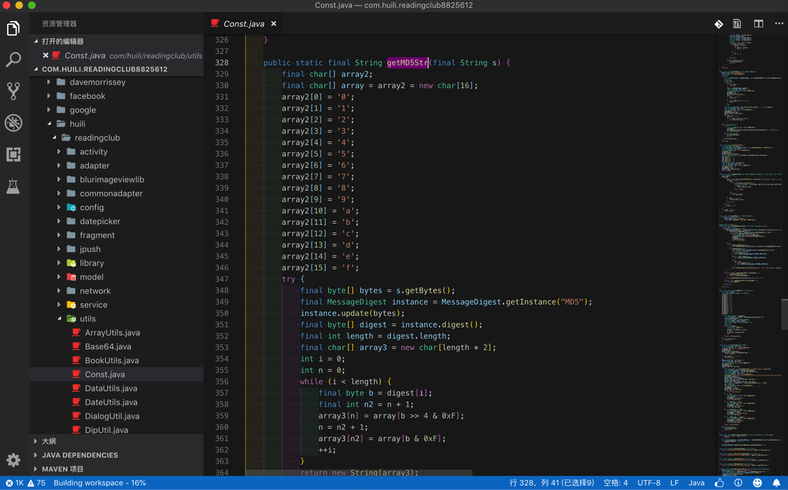

```java
    public static final String getMD5Str(final String s) {
        final char[] array2;
        final char[] array = array2 = new char[16];
        array2[0] = '0';
        array2[1] = '1';
        array2[2] = '2';
        array2[3] = '3';
        array2[4] = '4';
        array2[5] = '5';
        array2[6] = '6';
        array2[7] = '7';
        array2[8] = '8';
        array2[9] = '9';
        array2[10] = 'a';
        array2[11] = 'b';
        array2[12] = 'c';
        array2[13] = 'd';
        array2[14] = 'e';
        array2[15] = 'f';
        try {
            final byte[] bytes = s.getBytes();
            final MessageDigest instance = MessageDigest.getInstance("MD5");
            instance.update(bytes);
            final byte[] digest = instance.digest();
            final int length = digest.length;
            final char[] array3 = new char[length * 2];
            int i = 0;
            int n = 0;
            while (i < length) {
                final byte b = digest[i];
                final int n2 = n + 1;
                array3[n] = array[b >> 4 & 0xF];
                n = n2 + 1;
                array3[n2] = array[b & 0xF];
                ++i;
            }
            return new String(array3);
        }
        catch (Exception ex) {
            return null;
        }
    }
```

作为一个char的list，还是没有清晰的表达出来

更不像是CFR的：

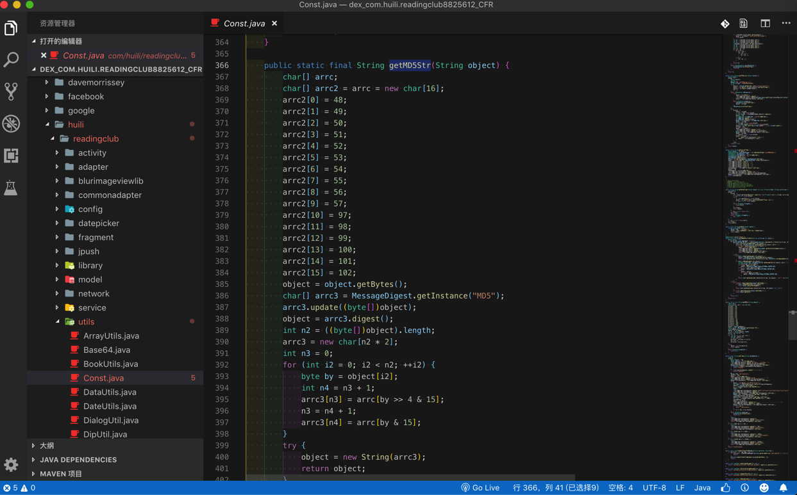

```java
    public static final String getMD5Str(String object) {
        char[] arrc;
        char[] arrc2 = arrc = new char[16];
        arrc2[0] = 48;
        arrc2[1] = 49;
        arrc2[2] = 50;
        arrc2[3] = 51;
        arrc2[4] = 52;
        arrc2[5] = 53;
        arrc2[6] = 54;
        arrc2[7] = 55;
        arrc2[8] = 56;
        arrc2[9] = 57;
        arrc2[10] = 97;
        arrc2[11] = 98;
        arrc2[12] = 99;
        arrc2[13] = 100;
        arrc2[14] = 101;
        arrc2[15] = 102;
        object = object.getBytes();
        char[] arrc3 = MessageDigest.getInstance("MD5");
        arrc3.update((byte[])object);
        object = arrc3.digest();
        int n2 = ((byte[])object).length;
        arrc3 = new char[n2 * 2];
        int n3 = 0;
        for (int i2 = 0; i2 < n2; ++i2) {
            byte by = object[i2];
            int n4 = n3 + 1;
            arrc3[n3] = arrc[by >> 4 & 15];
            n3 = n4 + 1;
            arrc3[n4] = arrc[by & 15];
        }
        try {
            object = new String(arrc3);
            return object;
        }
        catch (Exception exception) {
            return null;
        }
    }
```

连char的list都不够明显，只是char的int数值。

更更不像是`JD-GUI`导出的源码：

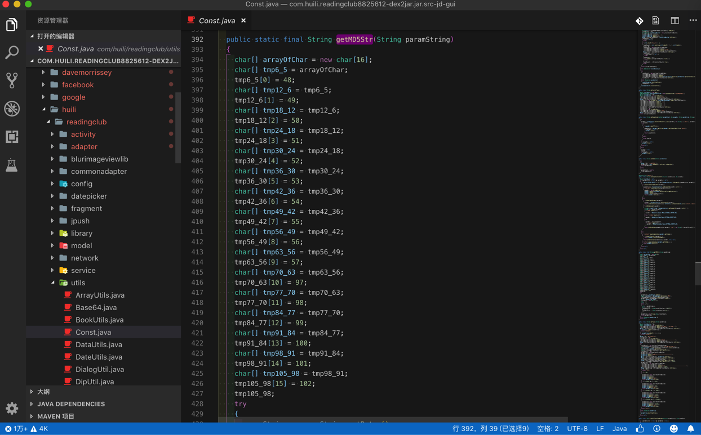

```java
  public static final String getMD5Str(String paramString)
  {
    char[] arrayOfChar = new char[16];
    char[] tmp6_5 = arrayOfChar;
    tmp6_5[0] = 48;
    char[] tmp12_6 = tmp6_5;
    tmp12_6[1] = 49;
    char[] tmp18_12 = tmp12_6;
    tmp18_12[2] = 50;
    char[] tmp24_18 = tmp18_12;
    tmp24_18[3] = 51;
    char[] tmp30_24 = tmp24_18;
    tmp30_24[4] = 52;
    char[] tmp36_30 = tmp30_24;
    tmp36_30[5] = 53;
    char[] tmp42_36 = tmp36_30;
    tmp42_36[6] = 54;
    char[] tmp49_42 = tmp42_36;
    tmp49_42[7] = 55;
    char[] tmp56_49 = tmp49_42;
    tmp56_49[8] = 56;
    char[] tmp63_56 = tmp56_49;
    tmp63_56[9] = 57;
    char[] tmp70_63 = tmp63_56;
    tmp70_63[10] = 97;
    char[] tmp77_70 = tmp70_63;
    tmp77_70[11] = 98;
    char[] tmp84_77 = tmp77_70;
    tmp84_77[12] = 99;
    char[] tmp91_84 = tmp84_77;
    tmp91_84[13] = 100;
    char[] tmp98_91 = tmp91_84;
    tmp98_91[14] = 101;
    char[] tmp105_98 = tmp98_91;
    tmp105_98[15] = 102;
    tmp105_98;
    try
    {
      paramString = paramString.getBytes();
      Object localObject = MessageDigest.getInstance("MD5");
      ((MessageDigest)localObject).update(paramString);
      paramString = ((MessageDigest)localObject).digest();
      int i = paramString.length;
      localObject = new char[i * 2];
      int j = 0;
      int k = 0;
      while (j < i)
      {
        int m = paramString[j];
        int n = k + 1;
        localObject[k] = ((char)arrayOfChar[(m >> 4 & 0xF)]);
        k = n + 1;
        localObject[n] = ((char)arrayOfChar[(m & 0xF)]);
        j++;
      }
      paramString = new String((char[])localObject);
      return paramString;
    }
    catch (Exception paramString) {}
    return null;
  }
```

连char的list不仅不够明显，不仅只是char的int数值，而且还有多余的赋值，影响代码逻辑的理解，以及对应的数据赋值：

```java
localObject[k] = ((char)arrayOfChar[(m >> 4 & 0xF)]);
```

都很晦涩难懂。

对于几种反编译抓换代码的出错程度和代码逻辑是否完美的结论是

* `JD-GUI`：某函数转换报错得不到源码
* `CFR`：某函数转换报错但有源码
* `Procyon`：某函数完美转换无错误
* `Jadx`：某函数完美转换外还能识别常量定义和代码结构更清晰
