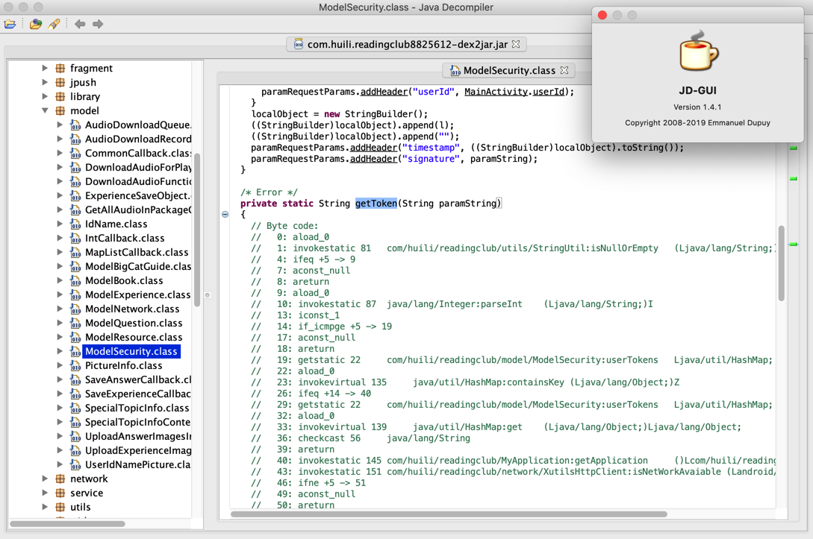
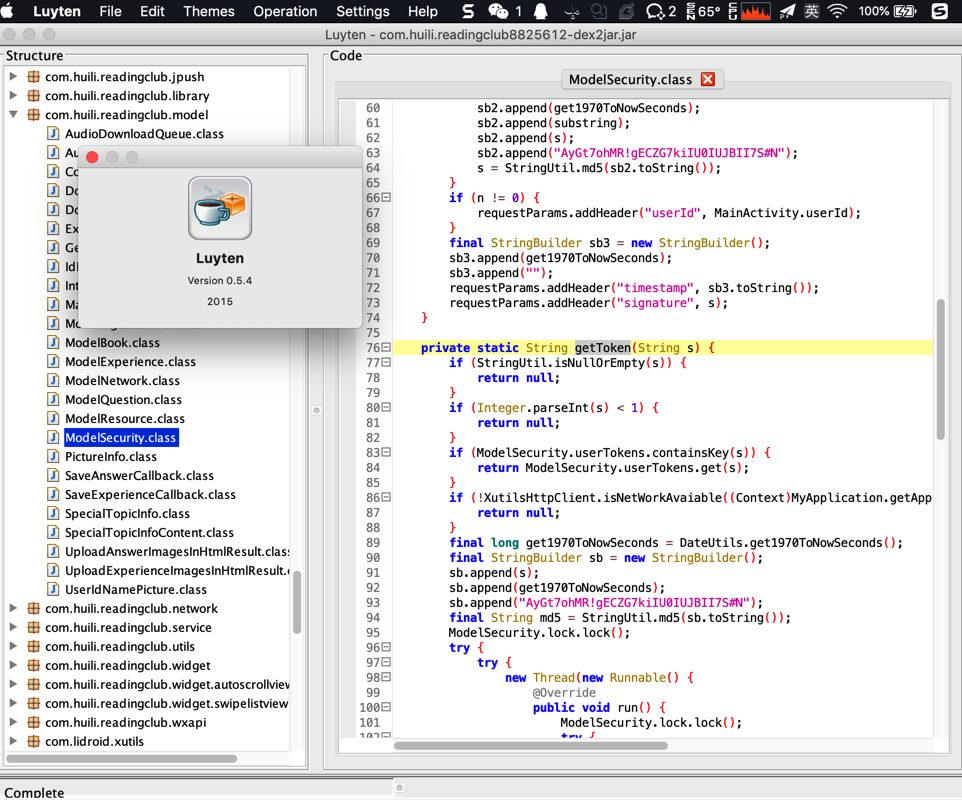
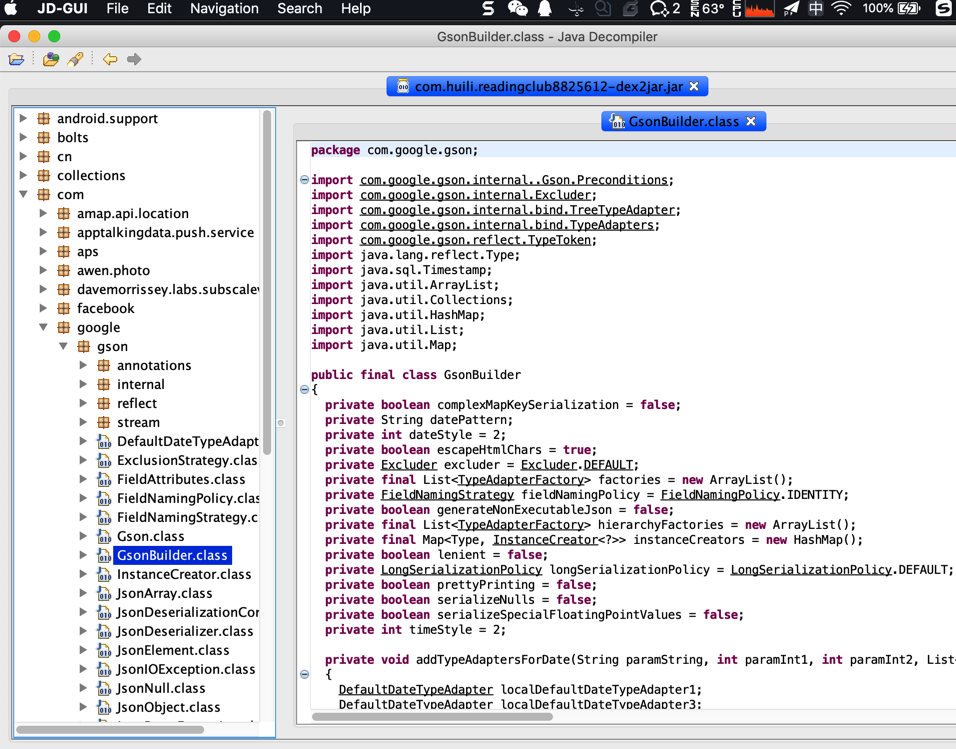
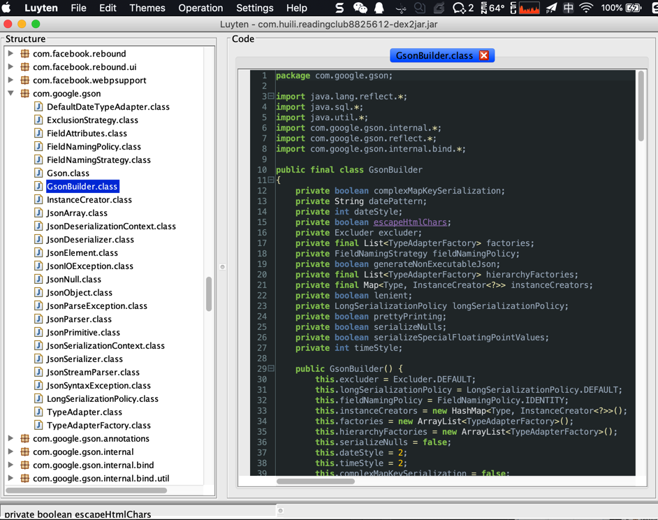
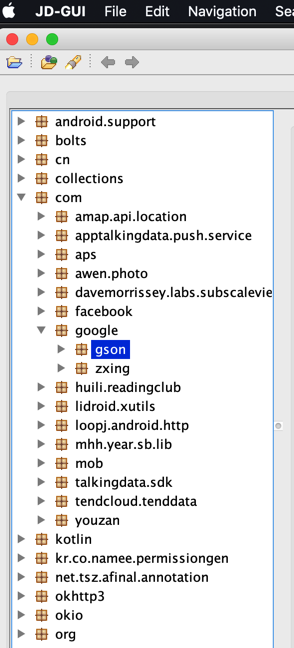
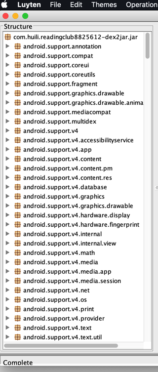
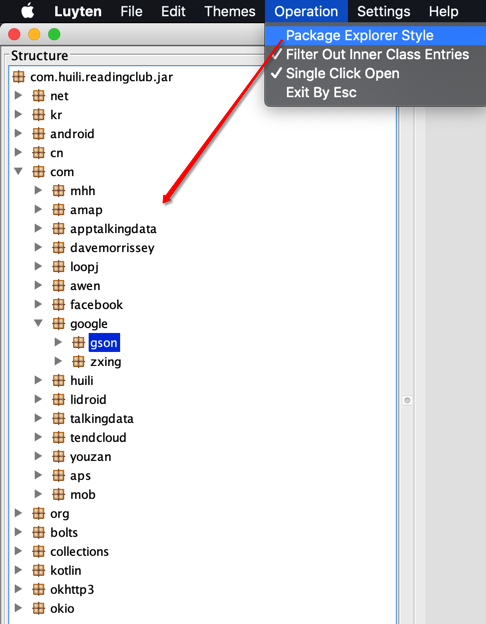

# `JD-GUI` vs (基于`Procyon`的)`Luyten`

| 对比项 | JD-GUI | Luyten |
| ----- | ------ | ------ |
| 流行程度 | 比较广->大家用的比较多 | 一般->相对使用的人不是很多 |
| jar转java的准确率 | 高  ->jd-gui代码转换出错Error   | 很高 ->Luyten中可正确解析显示源码：  |
| 显示：整体UI界面和代码高亮 | 比较简单和朴素->不够炫酷和好看    | 好看，而且支持多种语法高亮效果 -> 更方便看代码    |
| 显示：包/类的显示结构 | 以目录的树状结构显示的 -> 层次比较清晰    | （默认）平铺直叙，直接显示的 ->层次结构不够清晰      后记： 后来发现，把默认勾选的选项 `Operation`-> `Package Explorer Style` 取消勾选，也可以按照树状显示类和包名了：  |
