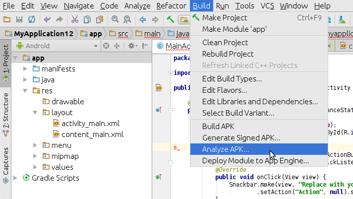
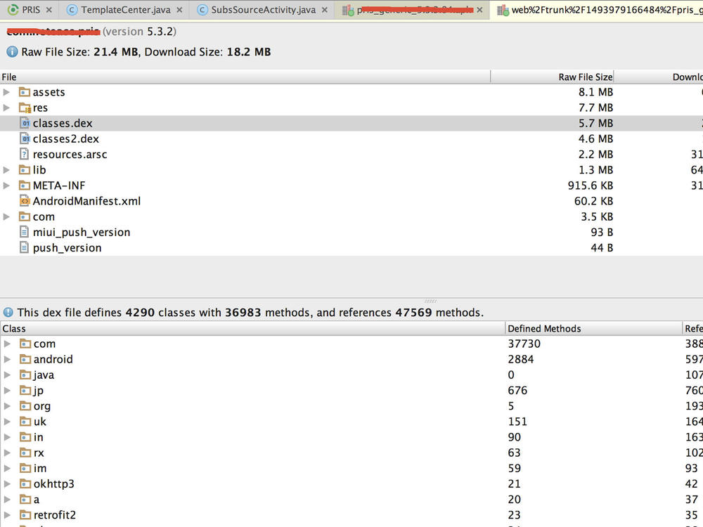
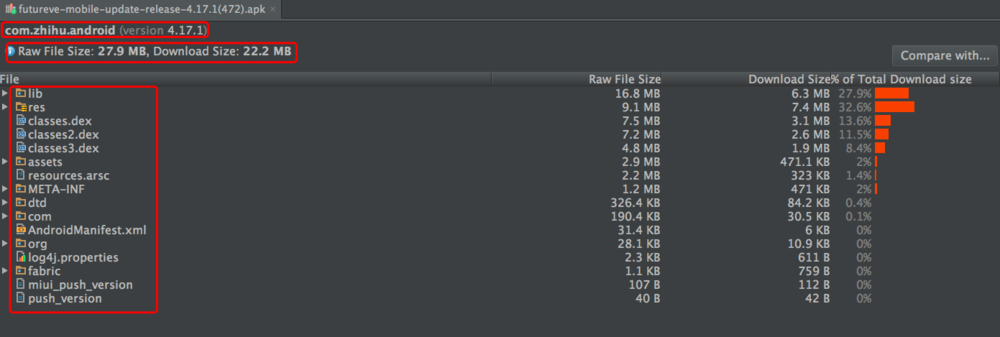
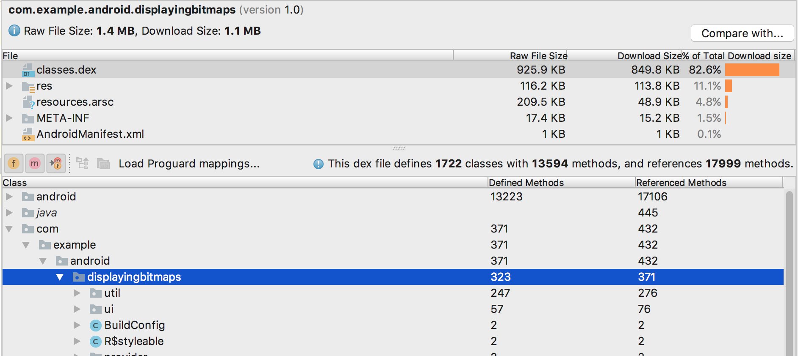

# APK Analyzer

* `Android Studio`在`v2.2`之后自带`APK Analyzer`
* 作用和功能
  * (重要)直观的看到apk中各个文件的大小(比如DEX，resource等等)
    * 我们可根据文件大小信息，减小apk的大小
  * (重要)学习大企业app的命名规范和目录架构规范，还可以查看大公司app使用了什么技术和第三方框架
  * 了解DEX文件的组成
  * 快速查看APK的版本信息（例如androidmanifest.xml等也可以看到）
  * 直接比较两个APK的信息，有对比才有伤害
* 下载
  * Android Studio
    * [Download Android Studio and SDK tools](https://developer.android.com/studio)
* 截图
  * 
  * 
  * 
  * 
