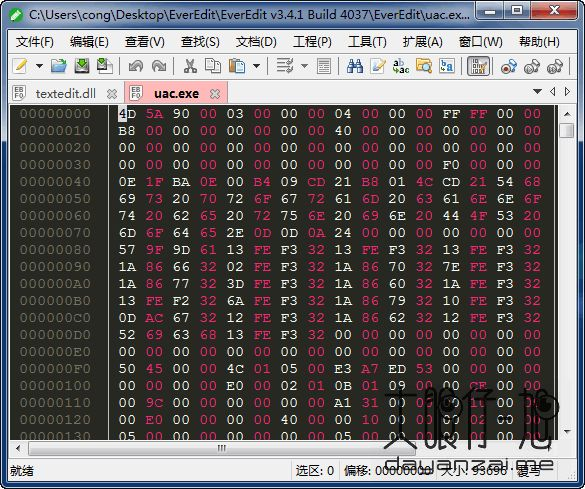
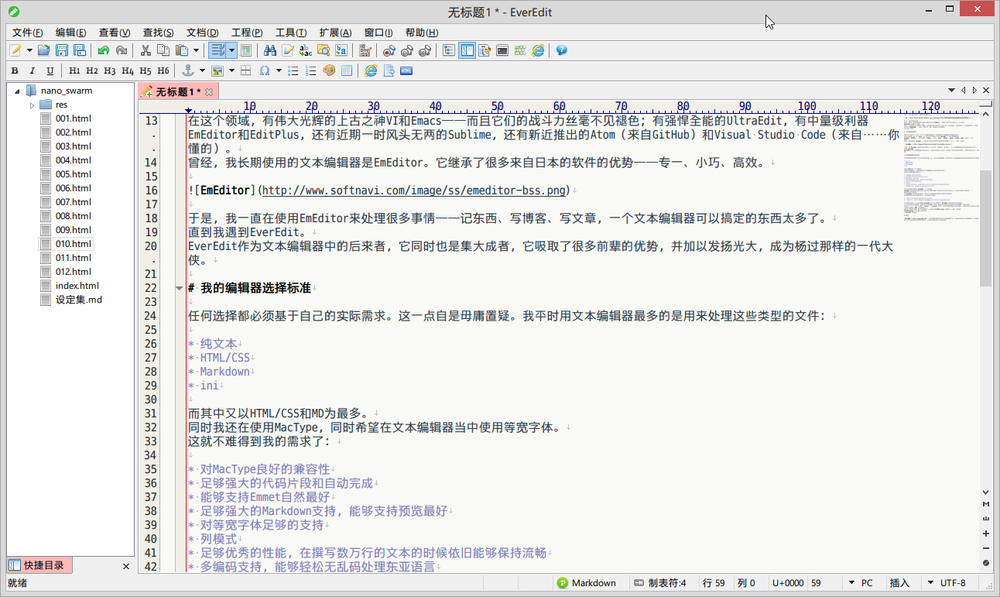

# EverEdit

* 首页
  * [首页 | EverEdit](http://cn.everedit.net)
* 下载
  * [下载 | EverEdit](http://cn.everedit.net/download)
* 功能
  * 专为国人设计的文本编辑器
    * 身躯小巧，性能卓越，自定义功能完善，丰富的主题和脚本，完美的编码、大字符集字符显示，无论您是哪个级别的码农，EverEdit都会给您带来不一样的体验！
* 特点
  * 多点编辑
    * 只需要轻按一下Alt+F3，她就会替你选择所有的同名变量；或者按Ctrl+D逐个向下选择。
  * 超强编码
    * 准确的探测文件的编码，一软在手，万码无忧！
  * Emmet/Zencoding
    * 完美支持Emmet,支持Tab一键展开那一大坨代码！
  * 完美Markdown
    * 内置markdown的预览，实时渲染，并排放置视图，一边改一边看，智能回车键和大纲！
  * 代码片段
    * 用Tab或者Shift+Tab在多个编辑点之间来回跳转。同名位置的引用，也会在修改时同时发生相同的变更。
  * 超大文件
    * 用较少的内存异步打开巨大文件！打开文件时，不会阻塞界面而且您可以随时取消该操作！
  * 二进制编辑
    * 内置二进制编辑器，瞬间打开任意大小的文件。并且可以进行查找和替换。同时对找到的字符串和被修改的位置进行高亮显示。
  * 文档地图
    * 文档地图以缩略图的形式显示出当前文档的整体外观；您可以拖放当前区域进行滚动和定位，甚至可以完全用它替换滚动条！
  * 函数列表
    * 列出安当前文件内所有的符号(类、函数、变量、宏等)，每个符号都会用一个恰当图标进行标示！
* 支持平台
  * Windows
* 截图
  * 
  * 
