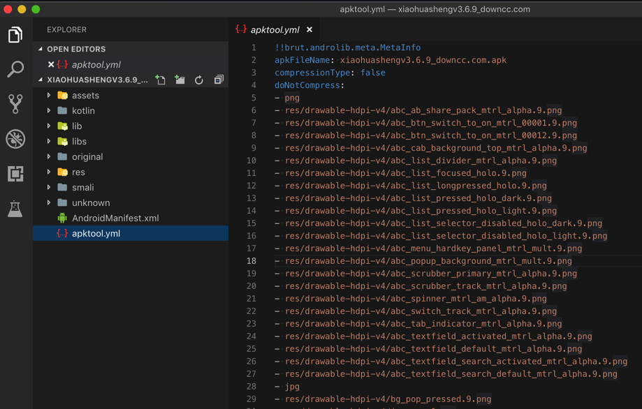
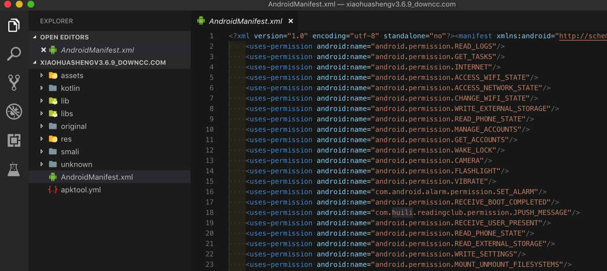
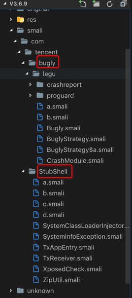
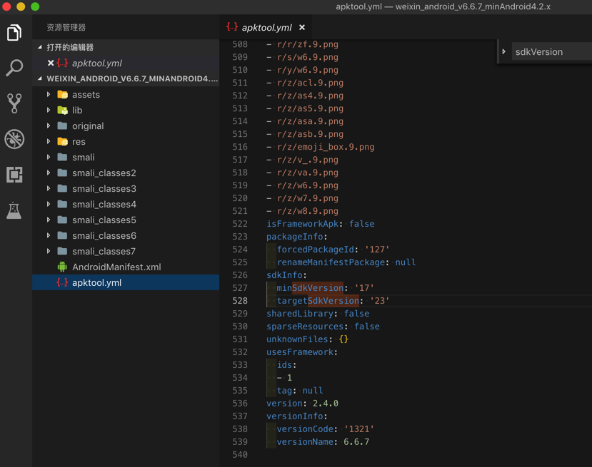
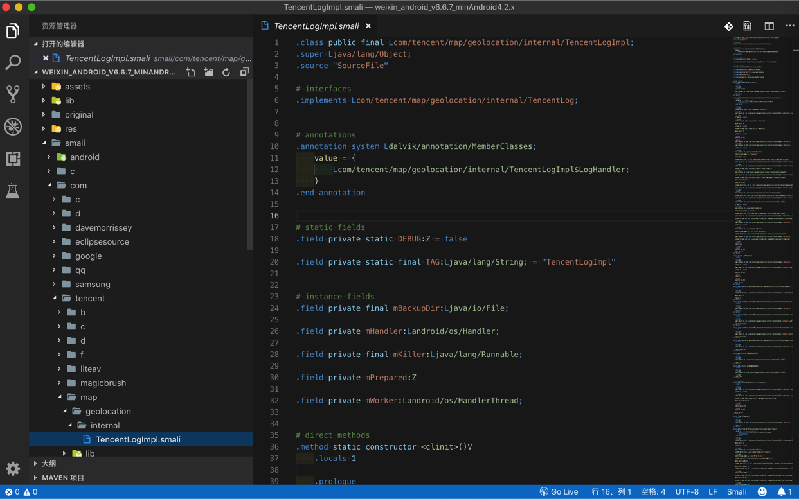

# apktool

* `apktool`是啥：一个用来逆向工程第三方的二进制的安卓app的工具
  * 即：逆向apk的工具
    * 输入：`apk`文件
    * 输出：各种安卓`资源文件`
  * 还可以用来：
    * 构建`自动化`工作 -> 取代重复的手动工作
      * 比如自动编译apk等工作
    * 给原有apk`添加额外东西`
      * 比如反编译出apk后
        * 再本地化localizing
        * 添加其他功能
    * `分析`原有apk的功能和逻辑
* 如何安装
  * [Apktool - How to Install](https://ibotpeaches.github.io/Apktool/install/)
* github主页
  * [iBotPeaches/Apktool: A tool for reverse engineering Android apk files](https://github.com/iBotPeaches/Apktool)
* 官网
  * [Apktool - A tool for reverse engineering 3rd party, closed, binary Android apps](https://ibotpeaches.github.io/Apktool/)
  * 官方提示
    * 请不要用apktool用于盗窃破解apk

## 举例

### 如何用apktool反编译某apk

下面举例说明，如何用apktool去反编译apk：

```bash
➜  apk ll
total 51280
-rw-r--r--@ 1 crifan  staff    25M  3 14 09:00 xiaohuashengv3.6.9_downcc.com.apk
➜  apk apktool d xiaohuashengv3.6.9_downcc.com.apk
I: Using Apktool 2.4.0 on xiaohuashengv3.6.9_downcc.com.apk
I: Loading resource table...
I: Decoding AndroidManifest.xml with resources...
S: WARNING: Could not write to (/Users/crifan/Library/apktool/framework), using /var/folders/46/2hjxz38n22n3ypp_5f6_p__00000gn/T/ instead...
S: Please be aware this is a volatile directory and frameworks could go missing, please utilize --frame-path if the default storage directory is unavailable
I: Loading resource table from file: /var/folders/46/2hjxz38n22n3ypp_5f6_p__00000gn/T/1.apk
I: Regular manifest package...
I: Decoding file-resources...
I: Decoding values */* XMLs...
I: Baksmaling classes.dex...
I: Copying assets and libs...
I: Copying unknown files...
I: Copying original files...
➜  apk ll
total 51280
drwxr-xr-x  12 crifan  staff   384B  3 14 13:39 xiaohuashengv3.6.9_downcc.com
-rw-r--r--@  1 crifan  staff    25M  3 14 09:00 xiaohuashengv3.6.9_downcc.com.apk
➜  apk cd xiaohuashengv3.6.9_downcc.com
➜  xiaohuashengv3.6.9_downcc.com ll
total 160
-rw-r--r--    1 crifan  staff    63K  3 14 13:39 AndroidManifest.xml
-rw-r--r--    1 crifan  staff    14K  3 14 13:39 apktool.yml
drwxr-xr-x   10 crifan  staff   320B  3 14 13:39 assets
drwxr-xr-x    8 crifan  staff   256B  3 14 13:39 kotlin
drwxr-xr-x    9 crifan  staff   288B  3 14 13:39 lib
drwxr-xr-x    3 crifan  staff    96B  3 14 13:39 libs
drwxr-xr-x    4 crifan  staff   128B  3 14 13:39 original
drwxr-xr-x  143 crifan  staff   4.5K  3 14 13:39 res
drwxr-xr-x    3 crifan  staff    96B  3 14 13:39 smali
drwxr-xr-x   10 crifan  staff   320B  3 14 13:39 unknown
```

得到项目目录文件：



其中有：

* 最基本的：`AndroidMenifest.xml`
  * 
* 得不到我们要的`dex`文件
* 可得到：和app业务逻辑相关代码的smali文件
  * 想要得到最终java源码的话
    * 需要再去找`smali转java`的工具才可以
    * 此处即使不去转换得到java源码
      * 也可以从smali文件的目录结构和文件名，大概能看出app内部的类/文件名了
  * 而用apktool转换apk得到smali源码，是有前提的：apk没有加固
    * 加固了的apk反编译后只能看到被加固后的目录结构，看不到app业务逻辑代码和结构
      * 举例：某个被腾讯乐固legu加了密的apk，反编译后看不到原始类名和目录结构，只能看到腾讯乐固的目录结构
        * 

### 用apktool反编译安卓版微信6.6.7

后来去从[这里](https://www.wandoujia.com/apps/com.tencent.mm/history_v1321)下载到`安卓版微信v6.6.7`，然后去用`apktool`去反编译：

```bash
➜  apktool ./apktool d /Users/crifan/dev/dev_tool/android/apk/weixin/weixin_android_v6.6.7_minAndroid4.2.x.apk
I: Using Apktool 2.4.0 on weixin_android_v6.6.7_minAndroid4.2.x.apk
I: Loading resource table...
I: Decoding AndroidManifest.xml with resources...
S: WARNING: Could not write to (/Users/crifan/Library/apktool/framework), using /var/folders/46/2hjxz38n22n3ypp_5f6_p__00000gn/T/ instead...
S: Please be aware this is a volatile directory and frameworks could go missing, please utilize --frame-path if the default storage directory is unavailable
I: Loading resource table from file: /var/folders/46/2hjxz38n22n3ypp_5f6_p__00000gn/T/1.apk
I: Regular manifest package...
I: Decoding file-resources...
I: Decoding values */* XMLs...
I: Baksmaling classes.dex...
I: Baksmaling classes2.dex...
I: Baksmaling classes3.dex...
I: Baksmaling classes4.dex...
I: Baksmaling classes5.dex...
I: Baksmaling classes6.dex...
I: Baksmaling classes7.dex...
I: Copying assets and libs...
I: Copying unknown files...
I: Copying original files...
➜  apktool ll
total 65480
-rwxr-xr-x@  1 crifan  staff   2.3K  3 14 11:26 apktool
-rw-r--r--@  1 crifan  staff    16M  3 14 11:29 apktool.jar
-rw-r--r--@  1 crifan  staff    16M  3 14 11:29 apktool_2.4.0.jar
drwxr-xr-x  15 crifan  staff   480B  4 30 17:35 weixin_android_v6.6.7_minAndroid4.2.x
```

然后去看看输出的信息：

```bash
➜  apktool cd weixin_android_v6.6.7_minAndroid4.2.x
➜  weixin_android_v6.6.7_minAndroid4.2.x ll
total 440
-rw-r--r--    1 crifan  staff   202K  4 30 17:35 AndroidManifest.xml
-rw-r--r--    1 crifan  staff   8.5K  4 30 17:35 apktool.yml
drwxr-xr-x   78 crifan  staff   2.4K  4 30 17:35 assets
drwxr-xr-x    3 crifan  staff    96B  4 30 17:35 lib
drwxr-xr-x    4 crifan  staff   128B  4 30 17:35 original
drwxr-xr-x  118 crifan  staff   3.7K  4 30 17:35 res
drwxr-xr-x    8 crifan  staff   256B  4 30 17:35 smali
drwxr-xr-x    8 crifan  staff   256B  4 30 17:35 smali_classes2
drwxr-xr-x   10 crifan  staff   320B  4 30 17:35 smali_classes3
drwxr-xr-x   12 crifan  staff   384B  4 30 17:35 smali_classes4
drwxr-xr-x   10 crifan  staff   320B  4 30 17:35 smali_classes5
drwxr-xr-x   12 crifan  staff   384B  4 30 17:35 smali_classes6
drwxr-xr-x    8 crifan  staff   256B  4 30 17:35 smali_classes7
➜  weixin_android_v6.6.7_minAndroid4.2.x cat AndroidManifest.xml
➜  weixin_android_v6.6.7_minAndroid4.2.x cat apktool.yml
!!brut.androlib.meta.MetaInfo
apkFileName: weixin_android_v6.6.7_minAndroid4.2.x.apk
compressionType: false
doNotCompress:
- arsc
- png
- sec
- conf
- dat
- txt
- data
- assets/infowindow_bg.9.png
- m4a
- wav
- assets/xwalk-command-line
- jpg
- mp3
- assets/wxa_library/local/IGNORE
- r/a/w6.9.png
- apk
- r/a7/v3.9.png
...
- r/q/aa2.9.png
- r/q/emoji_grid_item_bottom.9.png
- r/q/emoji_grid_item_left.9.png
- r/q/emoji_grid_item_middle.9.png
- gif
...
- r/r/ark.9.png
- r/r/emoji_app_msg_mask.9.png
- r/r/emoji_bottombar_bg.9.png
- r/r/emoji_box.9.png
- r/r/emoji_grid_item_fg_normal.9.png
- r/r/emoji_grid_item_fg_pressed.9.png
- r/r/tenpay_keybg.9.png
- r/r/tenpay_keyitem_bottom.9.png
- r/r/v3.9.png
...
- r/z/w8.9.png
isFrameworkApk: false
packageInfo:
  forcedPackageId: '127'
  renameManifestPackage: null
sdkInfo:
  minSdkVersion: '17'
  targetSdkVersion: '23'
sharedLibrary: false
sparseResources: false
unknownFiles: {}
usesFramework:
  ids:
  - 1
  tag: null
version: 2.4.0
versionInfo:
  versionCode: '1321'
  versionName: 6.6.7
```



可以看出一些版本方面的信息：

* `minSdkVersion: '17'`：最低安卓版本`17`
  * 17对应：安卓 `4.2`，`4.2.2`
* `targetSdkVersion: '23'`：目标安卓版本`23`
  * 23对应：安卓 `6.0`
* `versionName: 6.6.7`：微信版本号 `6.6.7`

以及有很多的smali代码：

