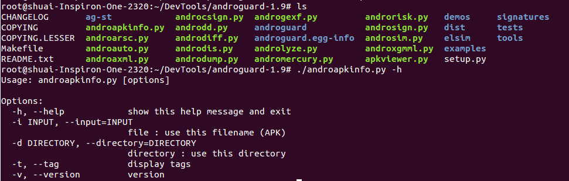
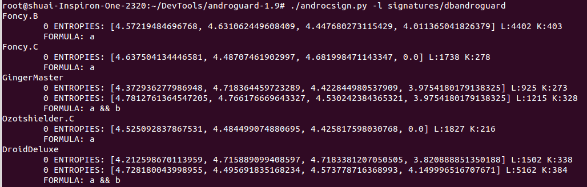
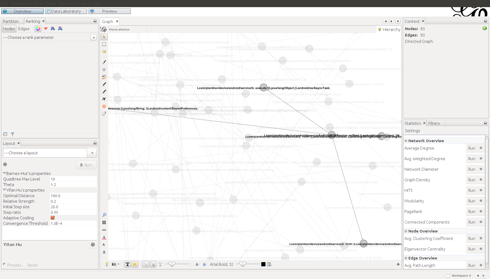

# Androguard

* 主页
  * [androguard/androguard: Reverse engineering, Malware and goodware analysis of Android applications](https://github.com/androguard/androguard)
* 文档
  * [Welcome to Androguard’s documentation! — Androguard 3.4.0 documentation](https://androguard.readthedocs.io/en/latest/)
* 功能
  * 主要用来进行静态分析安卓程序
  * 也可以用第三方库去反编译安卓
    * 支持的第三方库
      * `DAD`
      * `dex2jar + jad`
      * `DED`
* 包括多个模块/子功能
  * `androrisk.py`：该模块用于分析apk危险级别
  * `androapkinfo.py`：该模块分析apk列出其中的文件类型、权限、4大组件、是否NDK反射等信息
  * `androaxml.py`：该模块用于展示apk androidmanifest.xml
  * `androgexf.py`：该模块生成函数调用图
  * `apkviewer.py`：该模块生成指令级别的调用图
  * `androlyze.py`：该模块为交互分析环境
* 特点
  * 用`Python`写的
    * 支持多个平台：Linux/Windows/Mac
  * 支持多种模式
    * 命令行模式
    * 图形界面模式
    * 被当做库文件使用
* 截图
  * 
  * 
  * 