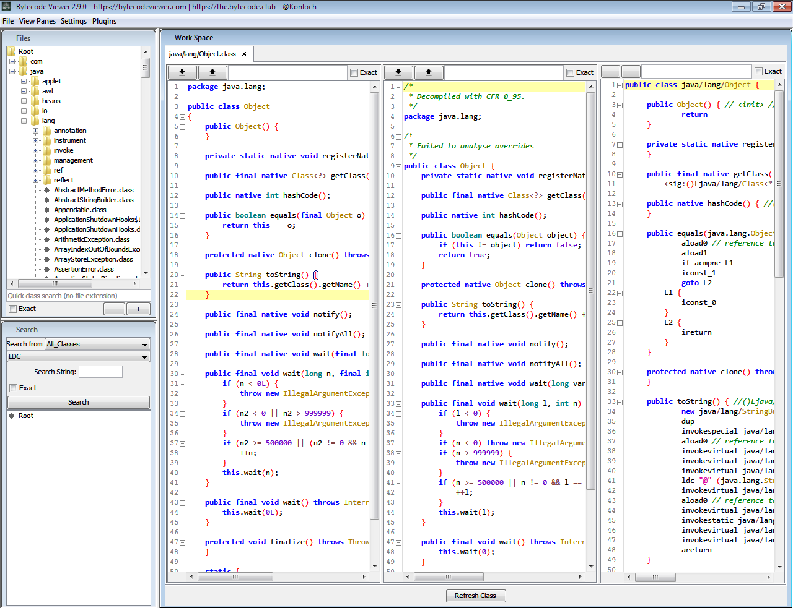

# ByteCode Viewer

* `Bytecode Viewer`=`BCV`
* 主页
  * 官网
    * [Bytecode Viewer - Java & Android APK Reverse Engineering Suite/Tool](https://bytecodeviewer.com)
  * github
    * [Konloch/bytecode-viewer: A Java 8 Jar & Android APK Reverse Engineering Suite (Decompiler, Editor, Debugger & More)](https://github.com/Konloch/bytecode-viewer)
* 功能
  * 概述：一款基于Java 8的Jar和APK的反编译工具包
    * 包含反编译、编辑、调试等众多工具
      * 具体包含
        * 基于图形界面的：
          * 轻量级的Java的字节码查看工具
          * Java反编译器
          * 字节码编辑器
          * Smali汇编器
          * Baksmali汇编器
          * APK编辑器
          * Dex编辑器
          * APK反编译器
          * Dex反编译器
          * Procyon的Java反编译器
          * Krakatau
          * CFR的Java反编译器
          * FernFlower的Java反编译器
          * DEX2Jar
          * Jar2DEX
          * Jar-Jar
        * 以及
          * Hex查看器
          * 代码搜索器
          * 调试器
        * 等等
    * 还支持插件系统
      * 允许你与加载的类文件进行交互
        * 举例
          * 你可以写一个字符串的反混淆工具，恶意代码搜索器，或者其他的一些你所能想到的东西
* 主要特性
  * 在Bytecode Viewer的编译／反编译工具中集成了Krakatau
  * 集成了Smali／BakSmali－现在，你可以通过smali来编辑类文件和dex文件了
  * 支持APK／DEX－使用了Dex2Jar和Jar2Dex，可以轻松加载并保存APK文件
  * Java反编译器－Bytecode Viewer的反编译工具中集成了FernFlower，Procyon和CFR
  * 字节码编译器－CFIED的修改版
  * 十六进制查看器－由JHexPane驱动
  * 每一个反编译器／编辑器／查看器都是可以进行切换的，你可以选择每一个操作面板上所显示的元素组件
  * 功能完整的搜索系统－可以搜索字符串，函数，以及变量等信息
  * 系统完全支持使用Groovy脚本
* 截图
  * 