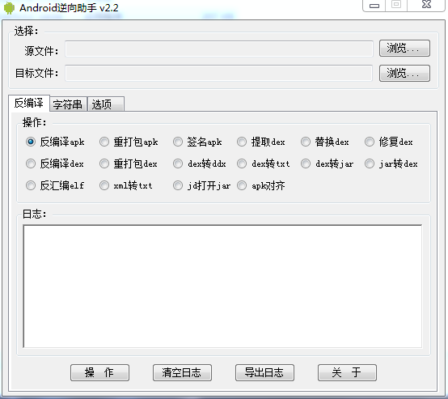
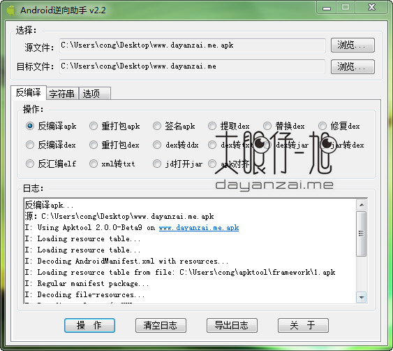
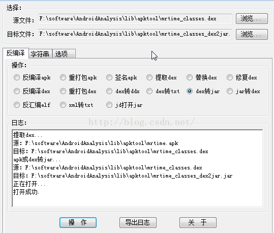

# Android逆向助手

* 作者：[大眼仔~旭](http://www.dayanzai.me)
* 简介
  * Android 逆向助手是一款针对安卓平台的强大逆向辅助软件，功能涵盖apk反编译打包签名；dex/jar互转替换提取修复；so反编译；xml、txt加密；字符串编码等。支持直接将文件拖放到源和目标文件这，不用每次都点浏览选择。
* 支持系统：
  * WinXP、Win7，Win2003
  * 注：其它系统没有测试
* 主要功能
  * 反编译apk
  * 重新打包成apk
  * 对apk进行签名
  * 反编译dex
  * 重新打包成dex
  * dex转jar
  * dex转ddx
  * dex导出成txt
  * 反编译so
  * jar转dex
  * 提取dex
  * 替换dex
  * 修复dex
  * 加密xml转txt
  * 字符串unicode编解码
* 特别说明：
  * **源文件**处支持文件或文件夹拖放
  * 必须安装`.Net Framework 2.0`框架
  * 部份功能依赖`java运行环境`，因此必须安装java
* 下载地址
  * 地址1：https://pan.baidu.com/s/1jI9L4IM
  * 地址2：[Android 逆向助手 v2.2 中文版 - 大眼仔旭](http://www.dayanzai.me/android-hack.html)
* 截图
  * 
  * 
  * 