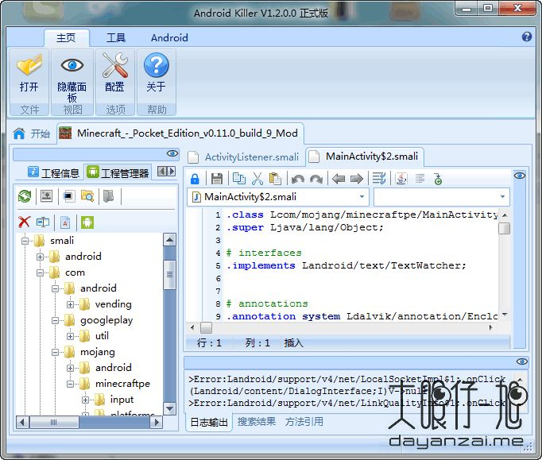
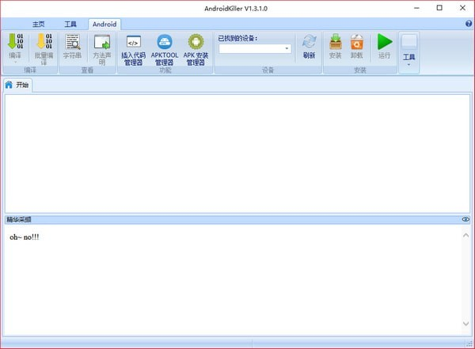

# AndroidKiller

* 作者：[大眼仔~旭](http://www.dayanzai.me)
* 功能
  * 一款可视化的安卓应用逆向工具
    * 集Apk反编译、Apk打包、Apk签名，编码互转，ADB通信（应用安装-卸载-运行-设备文件管理）等特色功能于一身，支持logcat日志输出，语法高亮，基于关键字（支持单行代码或多行代码段）项目内搜索，可自定义外部工具；吸收融汇多种工具功能与特点
    * 打造一站式逆向工具操作体验，大大简化了安卓应用/游戏修改过程中各类繁琐工作
* 下载
  * AndroidKiller v1.2
    * [安卓 APK 反汇编工具 AndroidKiller 1.2 中文绿色免费版 - 大眼仔旭](http://www.dayanzai.me/androidkiller.html)
  * AndroidKiller v1.3.1
    * [AndroidKiller下载|AndroidKiller(安卓APK反汇编工具)下载 v1.3.1绿色中文版_ - pc6下载站](http://www.pc6.com/softview/SoftView_641025.html)
* 截图
  * 
  * 