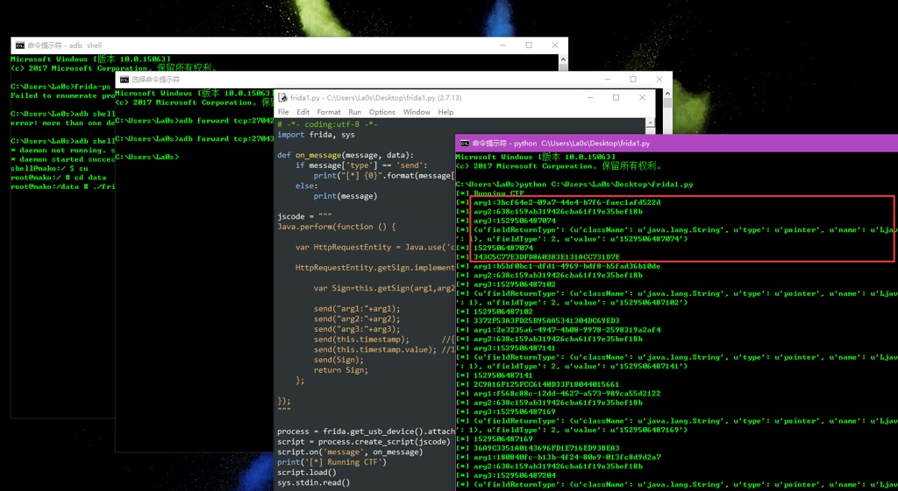

# frida

* 主页
  * Github
    * [Frida](https://github.com/frida/)
  * 官网
    * [Frida • A world-class dynamic instrumentation framework | Inject JavaScript to explore native apps on Windows, macOS, GNU/Linux, iOS, Android, and QNX](https://www.frida.re)
* 简介
  * 一款基于`python` + `javascript`的`hook框架`
  * 可运行在Android/iOS/Linux/Win/OSX等各平台
  * 主要使用动态二进制插桩(DBI)技术
    * 将外部代码注入到现有的正在运行的二进制文件中，从而让它执行额外操作
      * 支持哪些额外操作
        * 访问进程内存
        * 在应用程序运行时覆盖函数
        * 从导入的类调用函数
        * 在堆上查找对象实例并使用
        * Hook、跟踪和拦截函数等
      * 注：调试器也能完成相应工作，不过非常麻烦，比如各种反调试
* 功能和特点
  * Scriptable
    * Inject your own scripts into black box processes. Hook any function, spy on crypto APIs or trace private application code, no source code needed. Edit, hit save, and instantly see the results. All without compilation steps or program restarts.
  * Portable
    * Works on Windows, macOS, GNU/Linux, iOS, Android, and QNX. Install the Node.js bindings from npm, grab a Python package from PyPI, or use Frida through its Swift bindings, .NET bindings, Qt/Qml bindings, or C API.
  * Free
    * Frida is and will always be free software (free as in freedom). We want to empower the next generation of developer tools, and help other free software developers achieve interoperability through reverse engineering.
  * Battle-tested
    * We are proud that NowSecure is using Frida to do fast, deep analysis of mobile apps at scale. Frida has a comprehensive test-suite and has gone through years of rigorous testing across a broad range of use-cases.
* 文档
  * [Welcome | Frida • A world-class dynamic instrumentation framework](https://www.frida.re/docs/home/)
* 截图
  * 