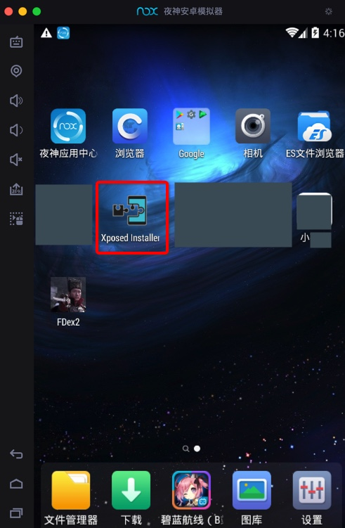

# XPosed框架

XPosed框架是用于安装相关插件`FDex2`，配合破解安卓，导出运行时app的dex文件。

而之前自己折腾过这个：`XPosed框架`=`XPosed Installer`

比如安装到了`夜神模拟器`中的`XPosed`：

更详细的解释详见专门教程：

* [强大的安卓破解辅助工具：XPosed框架](https://book.crifan.com/books/powerful_crack_tool_xposed_framework/website/)