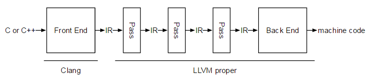

# Obfuscator-LLVM

* `Obfuscator-LLVM`=`ollvm`
  * 功能特性
    * `指令替换`
      * 参数：`-mllvm -sub`
      * 文档：[Instructions Substitution](https://github.com/obfuscator-llvm/obfuscator/wiki/Instructions-Substitution)
    * `Bogus控制流`
      * 参数：`-mllvm -bcf`
      * 文档：[Bogus Control Flow](https://github.com/obfuscator-llvm/obfuscator/wiki/Bogus-Control-Flow)
    * `控制流扁平化`=`控制流平坦化`
      * 参数：`-mllvm -fla`
      * 文档：[Control Flow Flattening](https://github.com/obfuscator-llvm/obfuscator/wiki/Bogus-Control-Flow)
    * `函数注解`
      * 文档：[Functions annotations](https://github.com/obfuscator-llvm/obfuscator/wiki/Bogus-Control-Flow)
  * 应用
    * 市场上一些加固厂商(比如360加固宝、梆梆加固)会使用改进的Obfuscator-LLVM对它们so文件中的一些关键函数采用Obfuscator-LLVM混淆，增加逆向的难度
    * 简单一点的是，用Obfuscator-LLVM混淆native代码，膨胀so并插入花指令
  * 文档
    * Github
      * obfuscator-llvm/obfuscator
        * https://github.com/obfuscator-llvm/obfuscator
    * Home · obfuscator-llvm/obfuscator Wiki
      * https://github.com/obfuscator-llvm/obfuscator/wiki
    * 最新版
      * obfuscator-llvm/obfuscator at llvm-4.0
        * https://github.com/obfuscator-llvm/obfuscator/tree/llvm-4.0

## 相关：llvm

* `LLVM`=`Low Level Virtual Machine`
  * 概述：a open source toolkit for the construction of highly optimized compilers, optimizers, and runtime environments
  * 其下很多子项目
    * LLVM Core
      * LLVM总体架构
        * 
    * [Clang](http://clang.llvm.org/)
    * [LLDB](http://lldb.llvm.org/)
    * [libc++](http://libcxx.llvm.org/) 和 [libc++ ABI](http://libcxxabi.llvm.org/)
    * [compiler-rt](http://compiler-rt.llvm.org/)
    * [MLIR](http://mlir.llvm.org/)
    * [OpenMP](http://openmp.llvm.org/)
    * [polly](http://polly.llvm.org/)
    * [libclc](http://libclc.llvm.org/)
    * [klee](http://klee.llvm.org/)
    * [LLD](http://lld.llvm.org/)
  * 官网
    * http://www.llvm.org/
