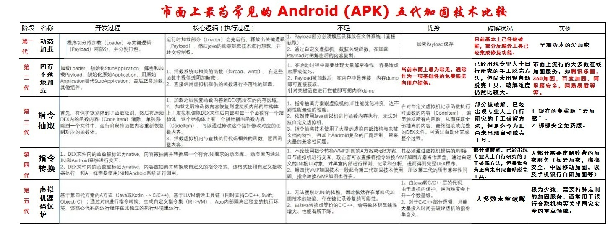

# 加固手段发展历史

* `加固`=`应用加固`
  * 含义：给原有的安卓应用，增加了保护手段，增强安全性，防止被轻易破解
  * 目的：
    * 比如
      * 使得别人即使反编译安卓应用得到了的jar包，也看不到原始的项目的源码
* `加固`的英文说法
  * 自己暂时用：`harden`
  * 被加固了的（apk）就叫：`hardened`
* 主要包括
  * 代码混淆
    * `java`层
    * `so`层=`native`层
  * `加壳`
    * 注：壳是一段保护软件不被非法修改或反编译的程序

下面整理安卓的加固技术的历史发展。

## 概述

常见Android的`APK`的五代加固技术比较：

* 加固的发展历史
  * 目前加固技术基本都发展到第三代
    * 前2代的加固技术破解难度不大，基本被淘汰
  * 第三代加固技术，由于各加固服务商加固原理大致相同
* 第三代加固技术主要有2种方式：
  * 对源apk整体做一个加固，放到指定位置，运行的时候再解密动态加载
    * 对apk加固的破解，叫做：脱壳=去壳
      * == Dex Method代码动态解密
  * 对so进行加固，在so加载内存的时候进行解密释放
    * 对so的加固的破解，叫做：so库反编译
      * == So代码膨胀混淆

## 不同历史阶段

用人类历史发展的阶段去类比解释如下：

### 原始社会时期

主要方式：`代码混淆`

### 奴隶社会时期

主要方式： `自我校验`

### 封建社会时期

主要方式： `dex文件变形`

### 资本主义社会时期

1. Dex保护
  1. 隐藏dex文件
    * 既然dex文件中包含了核心逻辑，那么把dex隐藏，再通过另外的方式加载起来，是不是就能达到保护dex的目的了呢?于是这成为一些第三方加固产品保护应用的方式。
    * 他们通过加密甚至压缩(早期是不存在压缩的，只是单纯的加密)方式把dex转换为另外一个文件。而被加固后的apk里面的dex则是那些第三方加固产品用来启动和加载隐藏dex的入口，也就是壳。
      * 感觉小花生v3.6.9 和 康美通 v.4.4.0就是这类？
      * 总之是看不到dex文件
  2. 对dex文件进行变形
    * 这里所说的变形，不同于封建社会时期提到的变形。这种办法不隐藏dex，而是让dex保留在外面，但是当破解者去分析这个dex的时候，会发现dex里面的内容是不完整的。
  3. 对dex结构进行变形
    * 此类方法是比较复杂的，了解dex结构的人应该很清楚，dex结构中包含DexClassDef、ClassDataItem、DexCode，这些是dalvik虚拟机运行一个dex必不可少的部分，特别是DexCode，DexCode包含了虚拟机运行的字节码指令。
    * 部分第三方加固产品开始尝试这种方式，他们的保护方案中可能抽取了DexCode中的部分，然后对字节码指令添加nop，或者连ClassDataItem和DexCode一同抽取，或者对上面提到的三个部分都做处理。抽取完之后，还要做修正、修复等工作，总之很烦锁。因为dex运行时有很多关于dex的校验，即使校验通过还有一些偏移问题。
    * Dex都被抽取修改后为什么还能运行呢?那是因为在运行之前或者运行之中对这个内存中的dex做修正。修正工作也很复杂，一般选择在运行之前做修正，这样可以减少很大的工作量，甚至可能还需要借助hook来帮忙。
2. So保护
  1. 修改Elf头、节表
    * 相关工具：
      * `010 Editor`
      * `IDA`
  2. 选择开源加壳工具
    * 最常用的：
      * UPX壳
      * 支持arm架构的ELF加固
  3. 进程防调试、或增加调试难度
    * 调试一个进程首先要ptrace这个进程
      * 防止进程被ptrace

### 社会主义时期

* 之前遗留问题
  1. 隐藏dex遗留的问题
    * 破解办法：
      * 实现自定义rom
      * 利用Inject原理将目标进程注入,代码进行hook系统函数来达到脱壳的目的
        * FDex2，DumpDex感觉就是用的这个机制？
  2. Dex结构变形带来的弊端
     * 安卓5.0新增了ART
      * ART可以直接将dex编译为本地指令运行
    * Dex结构变形遗留的问题很明显
      * 兼容性
      * ART模式下的编译问题
  3. ELF简单修改遗留问题
  4. UPX方面的劣势
      * 虽然upx是最为so加壳的首选，但是upx代码逻辑复杂，很难达到定制，特别是让它同时支持多种架构
          * -》基于上述原因一些第三方加固产品只是简单的利用upx加壳，并修改一些数据。不过很容易被有upx经验的人识破并脱壳
* 新防护技术
  * llvm混淆
    * 效果非常好，可以实现，即使被反编译后，也很难看懂代码逻辑
  * `VMP`
