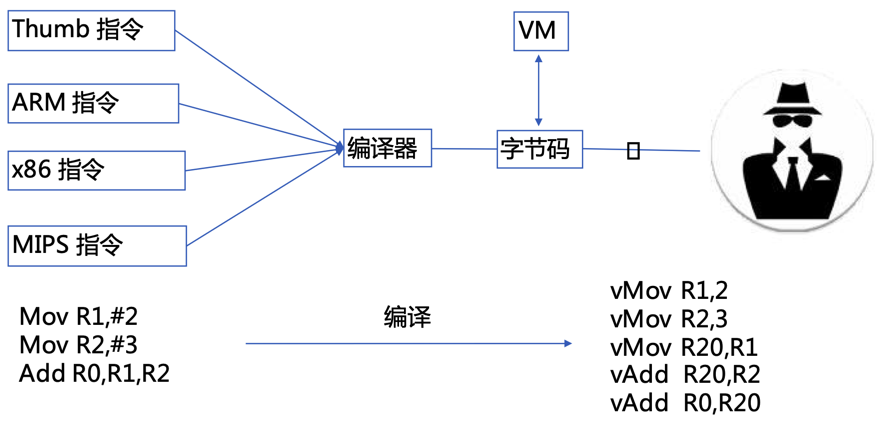
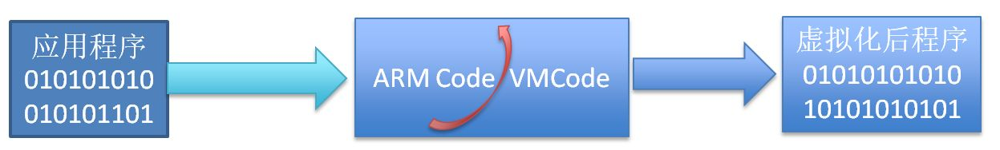
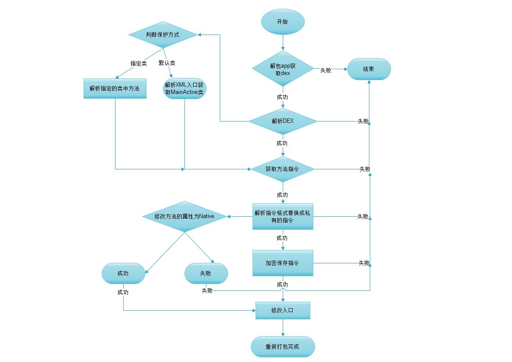
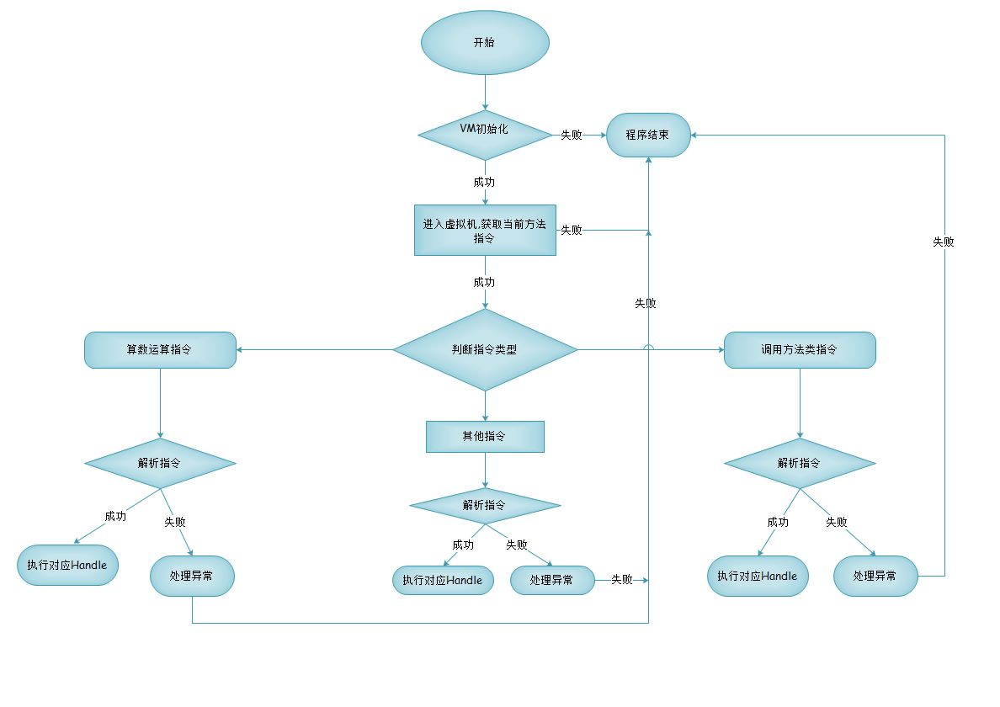

# VMP

新出的安卓加密技术，叫做：`VMP`

* `VMP`
  * 名称：`VMP`=`Virtual Machine Protection`=`虚拟机保护`=`虚拟软件保护技术`=`代码虚拟化`
  * 是什么：（安卓）代码加固领域的技术
  * 背景和起源
    * 俄罗斯的著名软件保护软件 VmProtect=虚拟机保护
      * 主页：[VMProtect Software Protection](https://vmpsoft.com/)
        * 以此为开端引起了软件保护壳领域的革命，各大软件保护壳都将虚拟机保护这一新颖的技术加入到自己的产品中
  * 为什么（要指令虚拟化）？
    * 软件保护壳的发展阶段
      * 第一阶段
        * 当壳完成解密目标代码时，它将不会再次控制程序，被保护程序的明文将在内存中展开。在此之前，壳可以调用一切系统手段来防治黑客的调试与逆向
      * 第二阶段
        * 可以实现分段式的加解密，壳运行完毕后，并不会消失而仍然会在程序运行到某个点时再次启动
      * 第三阶段
        * 其实最简单的解释是，将被保护的指令使用一套自定义的字节码(逻辑上等价)来替换掉程序中原有的指令，而字节码在执行的时候又由程序中的解释器来解释执行，自定义的字节码只有自己的解释器才能识别，也是因为这一点，基于虚拟机的保护相对其他保护而言要更加难分析
  * 核心原理
    * 代码虚拟化 = 基于`Dalvik`的解释器实现自己定义的指令
      * 说明
        * 将程序代码编译为虚拟机指令即虚拟代码(自己定义的代码集)，通过虚拟CPU解释并执行的一种方式
        * 自定义一套虚拟机指令和对应的解释器，并将标准的指令转换成自己的指令，然后由解释器将自己的指令给对应的解释器
      * 举例
        * x86或arm体系架构的标准汇编指令（mov、add、pop等），已变成了自定义加密汇编指令（xchg、db、dq等）
      * 图解
        * 
  * 运行机制
    * 
  * 运行流程
    * 加固端
      * 
    * 解释器
      * 
  * 缺点
    * 存在一定兼容性问题
    * 会降低代码执行效率
  * 应用
    * 说明
      * 由于兼容性和效率等问题，所以VMP一般只用于关键函数
        * 根据保护的内容，可以分
          * `DEX`的`VMP`
          * `SO`的`VMP`
      * 多数VMP的实现都是：直接把`smali`翻译成`c`实现
    * 举例
      * 爱加密
        * 所说的第四代vmp是先提取dex中的虚拟指令集，将dex中提取指令的方法清空，并将方法修改为native方法；然后通过爱加密自定义指令替换规则，替换提取的指令并保存到其他文件中
      * 通付盾
        * 实现了自定义指令集和自定义虚拟机运行环境的动态代码保护方案
        * 产品
          * 通付盾安全虚拟机 PayegisVM 3.0
  * 虚拟机
    * 背景：VMP的核心要点是，设计一个虚拟机，实现自定义指令的功能
    * 包含几大模块
      * VM 虚拟机核心
      * VM 编译器
        * 如何设计一个编译器?
          * 
        * 编译器工作流程
          * 1.反汇编ARM
          * 2.生成中间代码
          * 3.处理定位
          * 4.生成opcode
      * VM 链接器
      * VM 各种stub
    * 想实现一个基于虚拟机的保护壳，涉及内容
      * 随机VCode与Handle的关系映射
      * Handle混淆与乱序
      * 代码变形
      * 重定位
  * 资料
    * 网上某个开源实现
      * GitHub主页
        * eaglx/VMPROTECT: Obfuscation method using virtual machine.
          * https://github.com/eaglx/VMPROTECT
